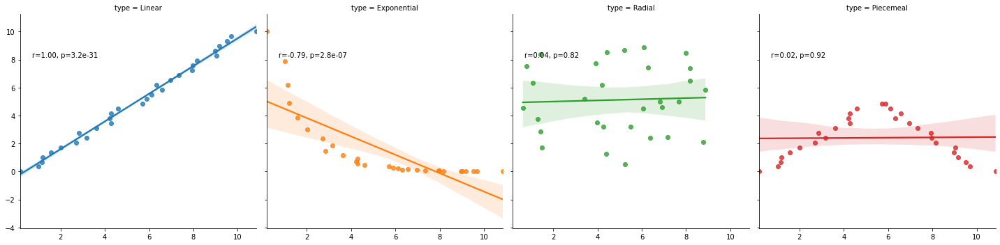

```python
# OPTIONAL: Load the "autoreload" extension so that code can change
%load_ext autoreload

# OPTIONAL: always reload modules so that as you change code in src, it gets loaded
%autoreload 2

%load_ext lab_black

import sys

sys.path.append("..")
from src.data import make_dataset

import pandas as pd
import matplotlib.pyplot as plt
```

    The autoreload extension is already loaded. To reload it, use:
      %reload_ext autoreload
    The lab_black extension is already loaded. To reload it, use:
      %reload_ext lab_black
    

# What are Gas Fired Power Stations?

[https://www.energy.gov/fe/how-gas-turbine-power-plants-work]

Gas Fired Power Stations work using gas turbine engines, turbine engines generally have four main parts to the process:

1. **Suck** - Air is drawn in to the engine

2. **Squeeze** - This air is pressurised, and fed in to the combustion chamber at a very high speed.

3. **Bang** - The combustion system feeds in fuel to mix with the air, this is then ignited at high temperatures.

4. **Blow** - The high temperatures expands the gas out the back of the engine, turning rotar blades which are dual prupose. Firstly, the blades draw more gas in to the system, and secondly they are used to generate electricity.

There are two types of gas fired power stations primarily used in the UK.

The first is CCGT (Combined Cycle Gas Turbine), this involves using a gas turbine to drive a gas turbine generator. Any excess heat is recovered by producing steam which drives a steam turbine generator for more electricity.

The second is OCGT (Open Cycle Gas Turbine), this is similar to CCGT but has an initial step of compressing the gas before being injected in the combustor.

# Future Energy Scenarios

Future Energy Scenarios (FES) are created to help the UK prepare for our future energy requirements, they inform investment and policy decisions from government to industry level. FES Scenarios are built using extensive data and modelling, and involve looking at consumer demand across gas, electricity, industrial, residental and transport.

[https://www.nationalgrideso.com/document/173821/download] On a high level, there are four energy scenarios.

1. Reaching net zero carbon emissions by 2050 is achievable.
However, this requires immediate action across all key
technologies and policy areas, and full engagement across
society and end consumers.
2. Hydrogen and carbon capture and storage must be deployed
for net zero. Industrial scale demonstration projects need to be
operational this decade.
3. The economics of energy supply and demand fundamentally shift
in a net zero world. Markets must evolve to provide incentives for
investment in flexibility and zero carbon generation.
4. Open data and digitalisation underpin the whole system thinking
required to achieve net zero. This is key to navigating increasing
complexity at lowest cost for consumers.

In all of these scenarios, National Grid project that Gas Fired Generation will continue to be important in some degree.


```python
volume = make_dataset.prepare_gas_volumes(
    r"C:\\Users\\rachel.hassall\\git\\charterful\\data\\raw\\GAS_VOLUME.csv"
)
print(
    f'In 2020, there were {volume[volume["ITEM"].str.contains("POWER STATION")]["ITEM"].nunique()} Power Stations drawing gas from the NTS'
)
```

    In 2020, there were 37 Power Stations drawing gas from the NTS
    

# Balancing Renewables

Gas electricity generation plays a crucial role in balancing renewable electricity generation. Looking at Wind Generation from direct connections to the Electricity System (excluding distributed generation) and CCGT generation average values per gas day, as a fraction of total electricity generation (to counteract seasonal variations) it's clear that power station generation is used to counteract variation in wind.


```python
elec = make_dataset.prepare_electricity_actuals(
    r"C:\Users\rachel.hassall\git\charterful\data\raw\ELECTRICITY_ACTUALS.csv"
)

percent_of_ted = elec[["CCGT", "WIND"]].div(elec["TED"], axis=0)
percent_of_ted[percent_of_ted.index.year == 2020].plot(figsize=(40, 20))
plt.title("Gas generation is used to counteract fluctuating wind generation")
plt.ylabel("Fraction of Total Generation per Gas Day")
plt.xlabel("Time")
plt.show()
```


    

    


# References

- https://www.nationalgrid.com/uk/gas-transmission/document/110176/download
- https://www.nationalgrideso.com/document/173821/download
- https://www.nationalgrideso.com/document/173796/download
- https://www.energy.gov/fe/how-gas-turbine-power-plants-work


```python

```
