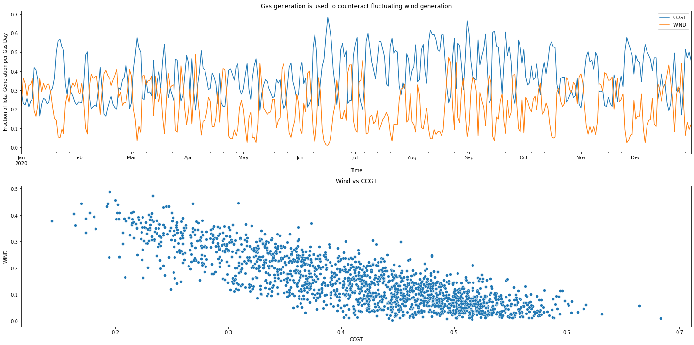

```python
# OPTIONAL: Load the "autoreload" extension so that code can change
%load_ext autoreload

# OPTIONAL: always reload modules so that as you change code in src, it gets loaded
%autoreload 2

%load_ext lab_black

import sys

sys.path.append("..")
from src.data import make_dataset

import pandas as pd
import numpy as np
import matplotlib.pyplot as plt
import seaborn as sns

import statsmodels as sm
import scipy
```

# What are Gas Fired Power Stations?

[https://www.energy.gov/fe/how-gas-turbine-power-plants-work]

Gas Fired Power Stations work using gas turbine engines, turbine engines generally have four main parts to the process:

1. **Suck** - Air is drawn in to the engine

2. **Squeeze** - This air is pressurised, and fed in to the combustion chamber at a very high speed.

3. **Bang** - The combustion system feeds in fuel to mix with the air, this is then ignited at high temperatures.

4. **Blow** - The high temperatures expands the gas out the back of the engine, turning rotar blades which are dual prupose. Firstly, the blades draw more gas in to the system, and secondly they are used to generate electricity.

There are two types of gas fired power stations primarily used in the UK.

The first is CCGT (Combined Cycle Gas Turbine), this involves using a gas turbine to drive a gas turbine generator. Any excess heat is recovered by producing steam which drives a steam turbine generator for more electricity.

The second is OCGT (Open Cycle Gas Turbine), this is similar to CCGT but has an initial step of compressing the gas before being injected in the combustor.

# Historically


```python
volume = make_dataset.prepare_gas_volumes(
    r"C:\\Users\\rachel.hassall\\git\\charterful\\data\\raw\\GAS_VOLUME.csv"
)

volume["YEAR"] = volume["GAS_DAY"].dt.year
volume["POWERSTATION"] = volume["ITEM"].str.contains("POWER STATION")
volume.groupby(["YEAR", "POWERSTATION"])["ITEM"].nunique()
```


    YEAR  POWERSTATION
    2016  False           148
          True             39
    2017  False           148
          True             38
    2018  False           147
          True             38
    2019  False           148
          True             38
    2020  False           147
          True             36
    Name: ITEM, dtype: int64


There were 37 power stations drawing gas from the NTS in 2020.

# Balancing Renewables

Gas electricity generation plays a crucial role in balancing renewable electricity generation. Looking at Wind Generation from direct connections to the Electricity System (excluding distributed generation) and CCGT generation average values per gas day, as a fraction of total electricity generation (to counteract seasonal variations) it's visually clear that power station generation is used to counteract variation in wind.


```python
elec = make_dataset.prepare_electricity_actuals(
    r"C:\Users\rachel.hassall\git\charterful\data\raw\ELECTRICITY_ACTUALS.csv"
)

percent_of_ted = elec[["CCGT", "WIND"]].div(elec["TED"], axis=0)
percent_of_ted[percent_of_ted.index.year == 2020].plot(figsize=(40, 20))
plt.title("Gas generation is used to counteract fluctuating wind generation")
plt.ylabel("Fraction of Total Generation per Gas Day")
plt.xlabel("Time")
plt.show()
```


    

    


Statistically speaking, we can prove this in a number of ways. Firstly, correlation analysis.

## Pearsons Correlation

The pearsons correlation coefficient (Pearson's r) measures linear correlation between two variables, assuming those variables are independent and normally distributed.


It's important to note that this is a measure of linear correlation, and may ignore other types of correlation. For example, below we see that the exponential relationship has quite a high Pearson's r value, despite the relationship in the data being exponential. Equally, in the piecewise figure, there are two linear piecewise relationships that the Pearson's r doesn't show.


[https://en.wikipedia.org/wiki/Pearson_correlation_coefficient]
[https://towardsdatascience.com/four-ways-to-quantify-synchrony-between-time-series-data-b99136c4a9c9]
[https://docs.scipy.org/doc/scipy/reference/generated/scipy.stats.pearsonr.html]


```python
nobs = 20
x = np.linspace(0, 10, nobs)
basex = x + np.random.rand(nobs)
df = pd.DataFrame({"x": basex, "y": x, "type": ["Linear"] * nobs})


df = df.append(
    pd.DataFrame(
        {"x": basex, "y": 10 * np.power(0.5, x), "type": ["Exponential"] * nobs}
    )
)

t = np.linspace(0, 2 * np.pi, nobs)
r = [np.random.uniform(1, 5) for i in np.arange(nobs)]
df = df.append(
    pd.DataFrame(
        {"x": 5 + r * np.cos(t), "y": 5 + r * np.sin(t), "type": ["Radial"] * nobs}
    )
)

df = df.append(
    pd.DataFrame(
        {"x": basex, "y": np.where(x < 5, x, -x + 10), "type": ["Piecemeal"] * nobs}
    )
)

g = sns.lmplot(data=df, x="x", y="y", col="type", hue="type")


def annotate(data, **kws):
    r, p = scipy.stats.pearsonr(data["x"], data["y"])
    ax = plt.gca()
    ax.text(0.05, 0.8, "r={:.2f}, p={:.2g}".format(r, p), transform=ax.transAxes)


g.map_dataframe(annotate)
plt.show()
```


    

    


In our time series data of electricity generation from Wind and Gas, Pearson's r is a measure of global synchrony. It has a significant value of -0.5, meaning that when wind goes up, gas does down and vice versa.


```python
df = elec[["CCGT", "WIND"]].copy()

r, p = scipy.stats.pearsonr(df.dropna()["CCGT"], df.dropna()["WIND"])
print(f"Scipy computed Pearson r: {r} and p-value: {p}")
```

    Scipy computed Pearson r: -0.5361356201066011 and p-value: 1.5357043092659718e-140
    

If we normalise Gas and Wind generation by looking at it as a percentage of overall electricity generation (demand), we see the correlation increases further. This has the handy benefit of removing seasonal variations in electricity demand (high in winter, low in summer).


```python
r, p = scipy.stats.pearsonr(
    percent_of_ted.dropna()["CCGT"], percent_of_ted.dropna()["WIND"]
)
print(f"Scipy computed Pearson r: {r} and p-value: {p}")
```

    Scipy computed Pearson r: -0.8143686270750832 and p-value: 0.0
    

## Grangers Causality

Granger's causality tests whether past values of one time series, x1, have a significantly significant effect from a sexond time series, x2.

Granger defined the causality relationship based on two principles:
- The cause happens prior to its effect.
- The cause has unique information about the future values of its effect.


We have to be careful with Granger's causality tests for a number of reasons, firstly it can be misleading when a 3rd process is driving the relationship between the variables. Secondly, the time series should be stationary, and thirdly, it is not robust to non linear relationships. We can extend the test to multivariate analysis (in our case, looking at all generation types) by using Vector Auto Regression, but for now, we'll stick with the basic causality test to start with.

[https://en.wikipedia.org/wiki/Granger_causality]


Our Null hypothesis for this test is that Wind Generation does not cause Gas Generation. This means that past values of wind do not have a statistically significant effect on the current Gas Generation value. We can reject this null hypothesis (and suggest that Wind Generation does cause Gas Generation) if the p value is below an appropriate level.

[https://www.statsmodels.org/stable/generated/statsmodels.tsa.stattools.grangercausalitytests.html]

The Null hypothesis for grangercausalitytests is that the time series in the second column, x2, does NOT Granger cause the time series in the first column, x1. Grange causality means that past values of x2 have a statistically significant effect on the current value of x1, taking past values of x1 into account as regressors. We reject the null hypothesis that x2 does not Granger cause x1 if the pvalues are below a desired size of the test.

The null hypothesis for all four test is that the coefficients corresponding to past values of the second time series are zero.


```python
sm.tsa.stattools.grangercausalitytests(df, 1)
```


    ---------------------------------------------------------------------------

    AttributeError                            Traceback (most recent call last)

    <ipython-input-14-8caf07ecd3e6> in <module>
    ----> 1 sm.tsa.stattools.grangercausalitytests(df, 1)
    

    AttributeError: module 'statsmodels' has no attribute 'tsa'


# Outlook

Future Energy Scenarios (FES) are created to help the UK prepare for our future energy requirements, they inform investment and policy decisions from government to industry level. FES Scenarios are built using extensive data and modelling, and involve looking at consumer demand across gas, electricity, industrial, residental and transport.

[https://www.nationalgrideso.com/document/173821/download] On a high level, there are four energy scenarios.

1. Reaching net zero carbon emissions by 2050 is achievable.
However, this requires immediate action across all key
technologies and policy areas, and full engagement across
society and end consumers.
2. Hydrogen and carbon capture and storage must be deployed
for net zero. Industrial scale demonstration projects need to be
operational this decade.
3. The economics of energy supply and demand fundamentally shift
in a net zero world. Markets must evolve to provide incentives for
investment in flexibility and zero carbon generation.
4. Open data and digitalisation underpin the whole system thinking
required to achieve net zero. This is key to navigating increasing
complexity at lowest cost for consumers.

In all of these scenarios, National Grid project that Gas Fired Generation will continue to be important in some degree.


# References

- https://www.nationalgrid.com/uk/gas-transmission/document/110176/download
- https://www.nationalgrideso.com/document/173821/download
- https://www.nationalgrideso.com/document/173796/download
- https://www.energy.gov/fe/how-gas-turbine-power-plants-work


```python

```
