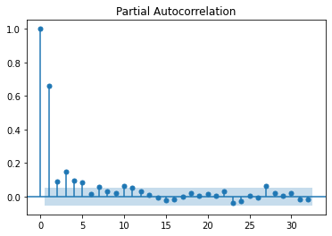
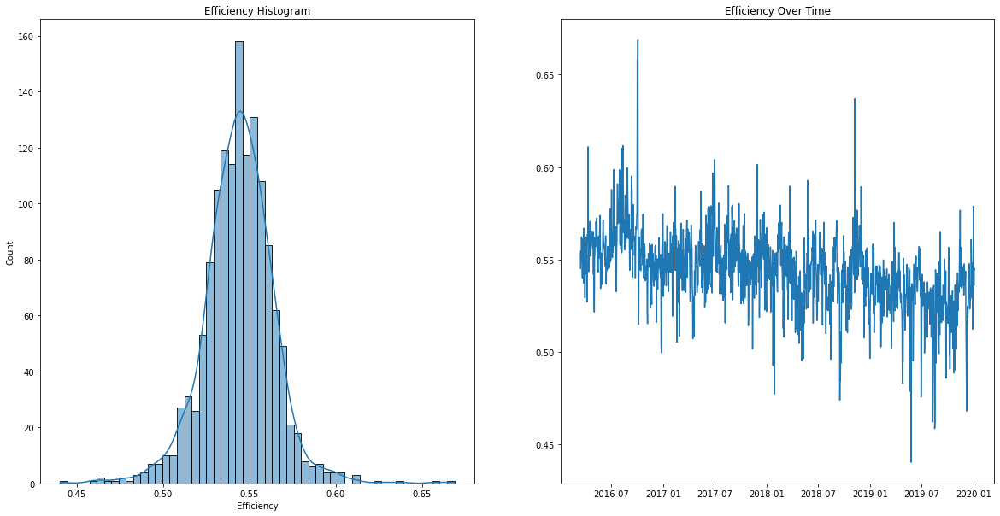

```python
# OPTIONAL: Load the "autoreload" extension so that code can change
%load_ext autoreload

# OPTIONAL: always reload modules so that as you change code in src, it gets loaded
%autoreload 2

%load_ext lab_black

import sys

sys.path.append("..")
from src.data import make_dataset

import pandas as pd
import numpy as np
import matplotlib.pyplot as plt
import seaborn as sns

import statsmodels as sm
import ppscore as pps
import scipy
```

# How efficient are gas fired power stations?

To understand efficiency of gas fired power stations, we must first define what efficiency is. We're defining efficiency in the context of energy conversion, which simplifies the system to mean that efficiency is the total energy in, divided by the total energy out.

To calculate this, we convert the total daily UK gas energy (using demand volume and calorific values for powerstations) to GWH/day.

Electricity data is given as average MW values per 30 minute settlement period, we convert this to a total GWH/day.

[https://en.wikipedia.org/wiki/Energy_conversion_efficiency]


```python
elec = make_dataset.prepare_electricity_actuals(
    r"C:\Users\rachel.hassall\git\charterful\data\raw\ELECTRICITY_ACTUALS.csv"
)
daily_elec_averages = elec[["CCGT", "OCGT"]].fillna(0).sum(axis=1)
daily_elec_GWH = daily_elec_averages * 24 / 1000
```

Electricity generation shows clear seasonality, which we explored partially in [1]. This is due to seasonally increased electricity demand, as well as fluctuations in wind and other generation components.


```python
def plot_series(series):
    fig, ax = plt.subplots(1, 2, figsize=(20, 10))

    sns.histplot(series, kde=True, ax=ax[0])
    ax[0].set_title(f"{series.name} Histogram")

    ax[1].plot(series)
    ax[1].set_title(f"{series.name} Over Time")
    plt.show()
```


```python
plot_series(daily_elec_GWH.rename("Electricity (GWH)"))
```


    

    


The energy provided by gas is derived from two primary attributes, its' volume and calorifiv value (CV). Volume is measured in MCM (million cubic meters) and refers to the quantity of gas in question. The CV is dependent on the gas content, and refers to the amount of energy released by the gas when a fixed volume is combusted.  [The CV of gas, which is dry, gross and measured at standard conditions of temperature (15oC) and pressure (1013.25 millibars), is usually quoted in megajoules per cubic metre (MJ/m3). Gas passing through our pipeline system has a CV of 37.5 MJ/m3 to 43.0 MJ/m3.]

This means to calculate the energy used we can start by multiplying the volume by the calorific value.


```python
gas_energy = make_dataset.prepare_gas_data(
    r"C:\Users\rachel.hassall\git\charterful\data\raw\GAS_ENERGY.csv"
).rename({"VALUE": "ENERGY"}, axis=1)
# kWH

gas_energy = make_dataset.map_to_sites(gas_energy)

# clean up the data types
gas_energy["ENERGY"] = (
    gas_energy["ENERGY"].str.replace(",", "").astype(float)
)  # some rogue string characters in there
gas_energy["ENERGY_GWH"] = gas_energy["ENERGY"] / 1000000
```

    C:\Users\rachel.hassall\.conda\envs\charterful\lib\site-packages\IPython\core\interactiveshell.py:3437: DtypeWarning: Columns (3) have mixed types.Specify dtype option on import or set low_memory=False.
      exec(code_obj, self.user_global_ns, self.user_ns)
    


```python
# calculate the daily average energy for all Powerstations
daily_gas_energy = gas_energy.groupby("GAS_DAY")["ENERGY_GWH"].sum().tz_localize(None)
```


```python
plot_series(daily_gas_energy.rename("Gas (GWH)"))
```


    

    


```python
df = pd.DataFrame({"ELECTRICITY": daily_elec_GWH, "GAS": daily_gas_energy}).dropna()
df["EFFICIENCY"] = df["ELECTRICITY"] / df["GAS"]
df["EFFICIENCY"].describe()
```


    count    1393.000000
    mean        0.687192
    std         0.052073
    min         0.527030
    25%         0.657998
    50%         0.688107
    75%         0.715965
    max         0.895248
    Name: EFFICIENCY, dtype: float64


Powerstations have a mean efficiency of 55%, peaking at 68% and troughing at 44%. 


```python
plot_series(df["EFFICIENCY"].rename("Efficiency"))
```


    

    


## Does Efficiency change seasonally?

In time series analysis, "seasonally" is used generically to mean patterns in data with a certain period. For example we can have yearly seasonality (winter effects) with a period of 365 days, as well as monthly seasonality (month end) with a period of 30 days and weekly seasonality (weekend effects) with a period of 7 days.

We can begin to decompose any seasonal affects by doing autocorrelation analysis and comparing each value with a lagged version of itself i.e. compare today's value with the value from a year ago.


```python
from statsmodels.graphics import tsaplots

fig, ax = plt.subplots(1, 1, figsize=(20, 10))

lags = None

a = tsaplots.plot_acf(df["EFFICIENCY"], lags=lags, ax=ax)
```


    

    


```python
b = tsaplots.plot_pacf(df["EFFICIENCY"], lags=lags)
```


    

    


A more complex method is to build an additive model to understand various seasonal components, the facebook prophet library does this very well so let's have a look.


```python
from statsmodels.tsa.seasonal import seasonal_decompose

seasonality = seasonal_decompose(df["EFFICIENCY"], model="additive")

a = seasonality.plot()
```


    

    


```python
from prophet import Prophet

proph_data = df["EFFICIENCY"].reset_index()
proph_data = proph_data.rename({"GAS_DAY" : "ds", "EFFICIENCY" : "y"}, axis=1)

m = Prophet()
m.fit()

future = m.make_future_dataframe(periods=365)

forecast = m.predict(future)


fig2 = m.plot_components(forecast)

```


    ---------------------------------------------------------------------------

    ModuleNotFoundError                       Traceback (most recent call last)

    <ipython-input-13-e5abe93f95dc> in <module>
    ----> 1 from prophet import Prophet
          2 
          3 proph_data = df["EFFICIENCY"].reset_index()
          4 proph_data = proph_data.rename({"GAS_DAY" : "ds", "EFFICIENCY" : "y"}, axis=1)
          5 
    

    ModuleNotFoundError: No module named 'prophet'


# Does Energy = Volume * CV?

- Calorific value is in MJ/scm
- Energy is in kWh
- Volume is in mscm


```python
gas_volume = make_dataset.prepare_gas_data(
    r"C:\Users\rachel.hassall\git\charterful\data\raw\GAS_VOLUME.csv"
).rename({"VALUE": "VOLUME"}, axis=1)
# kWH

gas_volume = make_dataset.map_to_sites(gas_volume)
gas_volume.head()
```


<div>
<style scoped>
    .dataframe tbody tr th:only-of-type {
        vertical-align: middle;
    }

    .dataframe tbody tr th {
        vertical-align: top;
    }

    .dataframe thead th {
        text-align: right;
    }
</style>
<table border="1" class="dataframe">
  <thead>
    <tr style="text-align: right;">
      <th></th>
      <th>ITEM</th>
      <th>GAS_DAY</th>
      <th>VOLUME</th>
      <th>SITE</th>
    </tr>
  </thead>
  <tbody>
    <tr>
      <th>17</th>
      <td>NTS PHYSICAL FLOWS, BAGLANBAY, NTS POWER STATION</td>
      <td>2016-03-14</td>
      <td>1.72800</td>
      <td>BAGLANBAY</td>
    </tr>
    <tr>
      <th>23</th>
      <td>NTS PHYSICAL FLOWS, BLACKBRIDGE, NTS POWER STA...</td>
      <td>2016-03-14</td>
      <td>8.12001</td>
      <td>BLACKBRIDGE</td>
    </tr>
    <tr>
      <th>33</th>
      <td>NTS PHYSICAL FLOWS, BRIGG, NTS POWER STATION</td>
      <td>2016-03-14</td>
      <td>0.00000</td>
      <td>BRIGG</td>
    </tr>
    <tr>
      <th>38</th>
      <td>NTS PHYSICAL FLOWS, BURTONPOINT, NTS POWER STA...</td>
      <td>2016-03-14</td>
      <td>0.40800</td>
      <td>BURTONPOINT</td>
    </tr>
    <tr>
      <th>48</th>
      <td>NTS PHYSICAL FLOWS, CORBY, NTS POWER STATION</td>
      <td>2016-03-14</td>
      <td>0.00000</td>
      <td>CORBY</td>
    </tr>
  </tbody>
</table>
</div>


```python
gas_cv = make_dataset.prepare_gas_data(
    r"C:\Users\rachel.hassall\git\charterful\data\raw\GAS_CV.csv"
).rename({"VALUE": "CV"}, axis=1)
# kWH

gas_cv = make_dataset.map_to_sites(gas_cv)
# MJ/scm
gas_cv.head()
```


<div>
<style scoped>
    .dataframe tbody tr th:only-of-type {
        vertical-align: middle;
    }

    .dataframe tbody tr th {
        vertical-align: top;
    }

    .dataframe thead th {
        text-align: right;
    }
</style>
<table border="1" class="dataframe">
  <thead>
    <tr style="text-align: right;">
      <th></th>
      <th>ITEM</th>
      <th>GAS_DAY</th>
      <th>CV</th>
      <th>SITE</th>
    </tr>
  </thead>
  <tbody>
    <tr>
      <th>17</th>
      <td>CALORIFIC VALUE, BAGLANBAY, NTS POWER STATION</td>
      <td>2016-03-14</td>
      <td>39.21</td>
      <td>BAGLANBAY</td>
    </tr>
    <tr>
      <th>23</th>
      <td>CALORIFIC VALUE, BLACKBRIDGE, NTS POWER STATION</td>
      <td>2016-03-14</td>
      <td>39.15</td>
      <td>BLACKBRIDGE</td>
    </tr>
    <tr>
      <th>33</th>
      <td>CALORIFIC VALUE, BRIGG, NTS POWER STATION</td>
      <td>2016-03-14</td>
      <td>39.74</td>
      <td>BRIGG</td>
    </tr>
    <tr>
      <th>38</th>
      <td>CALORIFIC VALUE, BURTONPOINT, NTS POWER STATION</td>
      <td>2016-03-14</td>
      <td>39.78</td>
      <td>BURTONPOINT</td>
    </tr>
    <tr>
      <th>49</th>
      <td>CALORIFIC VALUE, CORBY, NTS POWER STATION</td>
      <td>2016-03-14</td>
      <td>39.19</td>
      <td>CORBY</td>
    </tr>
  </tbody>
</table>
</div>


```python
gas_cv[gas_cv["SITE"] == "BURTONPOINT"]
```


<div>
<style scoped>
    .dataframe tbody tr th:only-of-type {
        vertical-align: middle;
    }

    .dataframe tbody tr th {
        vertical-align: top;
    }

    .dataframe thead th {
        text-align: right;
    }
</style>
<table border="1" class="dataframe">
  <thead>
    <tr style="text-align: right;">
      <th></th>
      <th>ITEM</th>
      <th>GAS_DAY</th>
      <th>CV</th>
      <th>SITE</th>
    </tr>
  </thead>
  <tbody>
    <tr>
      <th>38</th>
      <td>CALORIFIC VALUE, BURTONPOINT, NTS POWER STATION</td>
      <td>2016-03-14 00:00:00+00:00</td>
      <td>39.78</td>
      <td>BURTONPOINT</td>
    </tr>
    <tr>
      <th>365</th>
      <td>CALORIFIC VALUE, BURTONPOINT, NTS POWER STATION</td>
      <td>2016-03-15 00:00:00+00:00</td>
      <td>40.72</td>
      <td>BURTONPOINT</td>
    </tr>
    <tr>
      <th>693</th>
      <td>CALORIFIC VALUE, BURTONPOINT, NTS POWER STATION</td>
      <td>2016-03-16 00:00:00+00:00</td>
      <td>41.07</td>
      <td>BURTONPOINT</td>
    </tr>
    <tr>
      <th>1021</th>
      <td>CALORIFIC VALUE, BURTONPOINT, NTS POWER STATION</td>
      <td>2016-03-17 00:00:00+00:00</td>
      <td>40.09</td>
      <td>BURTONPOINT</td>
    </tr>
    <tr>
      <th>1349</th>
      <td>CALORIFIC VALUE, BURTONPOINT, NTS POWER STATION</td>
      <td>2016-03-18 00:00:00+00:00</td>
      <td>39.56</td>
      <td>BURTONPOINT</td>
    </tr>
    <tr>
      <th>...</th>
      <td>...</td>
      <td>...</td>
      <td>...</td>
      <td>...</td>
    </tr>
    <tr>
      <th>449662</th>
      <td>CALORIFIC VALUE, BURTONPOINT, NTS POWER STATION</td>
      <td>2020-01-01 00:00:00+00:00</td>
      <td>42.03</td>
      <td>BURTONPOINT</td>
    </tr>
    <tr>
      <th>449948</th>
      <td>CALORIFIC VALUE, BURTONPOINT, NTS POWER STATION</td>
      <td>2020-01-02 00:00:00+00:00</td>
      <td>41.87</td>
      <td>BURTONPOINT</td>
    </tr>
    <tr>
      <th>450266</th>
      <td>CALORIFIC VALUE, BURTONPOINT, NTS POWER STATION</td>
      <td>2020-01-03 00:00:00+00:00</td>
      <td>40.40</td>
      <td>BURTONPOINT</td>
    </tr>
    <tr>
      <th>450584</th>
      <td>CALORIFIC VALUE, BURTONPOINT, NTS POWER STATION</td>
      <td>2020-01-04 00:00:00+00:00</td>
      <td>42.18</td>
      <td>BURTONPOINT</td>
    </tr>
    <tr>
      <th>450882</th>
      <td>CALORIFIC VALUE, BURTONPOINT, NTS POWER STATION</td>
      <td>2020-01-05 00:00:00+00:00</td>
      <td>41.30</td>
      <td>BURTONPOINT</td>
    </tr>
  </tbody>
</table>
<p>1391 rows × 4 columns</p>
</div>


```python
compare = gas_volume.merge(
    gas_cv, left_on=["GAS_DAY", "SITE"], right_on=["GAS_DAY", "SITE"]
)
compare = compare.merge(
    gas_energy, left_on=["GAS_DAY", "SITE"], right_on=["GAS_DAY", "SITE"]
)
compare
```


<div>
<style scoped>
    .dataframe tbody tr th:only-of-type {
        vertical-align: middle;
    }

    .dataframe tbody tr th {
        vertical-align: top;
    }

    .dataframe thead th {
        text-align: right;
    }
</style>
<table border="1" class="dataframe">
  <thead>
    <tr style="text-align: right;">
      <th></th>
      <th>ITEM_x</th>
      <th>GAS_DAY</th>
      <th>VOLUME</th>
      <th>SITE</th>
      <th>ITEM_y</th>
      <th>CV</th>
      <th>ITEM</th>
      <th>ENERGY</th>
      <th>ENERGY_GWH</th>
    </tr>
  </thead>
  <tbody>
    <tr>
      <th>0</th>
      <td>NTS PHYSICAL FLOWS, BAGLANBAY, NTS POWER STATION</td>
      <td>2016-03-14</td>
      <td>1.72800</td>
      <td>BAGLANBAY</td>
      <td>CALORIFIC VALUE, BAGLANBAY, NTS POWER STATION</td>
      <td>39.21</td>
      <td>NTS ENERGY OFFTAKEN, BAGLANBAY, NTS POWER STATION</td>
      <td>18816562.0</td>
      <td>18.816562</td>
    </tr>
    <tr>
      <th>1</th>
      <td>NTS PHYSICAL FLOWS, BLACKBRIDGE, NTS POWER STA...</td>
      <td>2016-03-14</td>
      <td>8.12001</td>
      <td>BLACKBRIDGE</td>
      <td>CALORIFIC VALUE, BLACKBRIDGE, NTS POWER STATION</td>
      <td>39.15</td>
      <td>NTS ENERGY OFFTAKEN, BLACKBRIDGE, NTS POWER ST...</td>
      <td>88322211.0</td>
      <td>88.322211</td>
    </tr>
    <tr>
      <th>2</th>
      <td>NTS PHYSICAL FLOWS, BRIGG, NTS POWER STATION</td>
      <td>2016-03-14</td>
      <td>0.00000</td>
      <td>BRIGG</td>
      <td>CALORIFIC VALUE, BRIGG, NTS POWER STATION</td>
      <td>39.74</td>
      <td>NTS ENERGY OFFTAKEN, BRIGG, NTS POWER STATION</td>
      <td>0.0</td>
      <td>0.000000</td>
    </tr>
    <tr>
      <th>3</th>
      <td>NTS PHYSICAL FLOWS, BURTONPOINT, NTS POWER STA...</td>
      <td>2016-03-14</td>
      <td>0.40800</td>
      <td>BURTONPOINT</td>
      <td>CALORIFIC VALUE, BURTONPOINT, NTS POWER STATION</td>
      <td>39.78</td>
      <td>NTS ENERGY OFFTAKEN, BURTONPOINT, NTS POWER ST...</td>
      <td>4504462.0</td>
      <td>4.504462</td>
    </tr>
    <tr>
      <th>4</th>
      <td>NTS PHYSICAL FLOWS, CORBY, NTS POWER STATION</td>
      <td>2016-03-14</td>
      <td>0.00000</td>
      <td>CORBY</td>
      <td>CALORIFIC VALUE, CORBY, NTS POWER STATION</td>
      <td>39.19</td>
      <td>NTS ENERGY OFFTAKEN, CORBY, NTS POWER STATION</td>
      <td>0.0</td>
      <td>0.000000</td>
    </tr>
    <tr>
      <th>...</th>
      <td>...</td>
      <td>...</td>
      <td>...</td>
      <td>...</td>
      <td>...</td>
      <td>...</td>
      <td>...</td>
      <td>...</td>
      <td>...</td>
    </tr>
    <tr>
      <th>52333</th>
      <td>NTS PHYSICAL FLOWS, STAYTHORPE, NTS POWER STATION</td>
      <td>2020-01-05</td>
      <td>1.32000</td>
      <td>STAYTHORPE</td>
      <td>CALORIFIC VALUE, STAYTHORPE, NTS POWER STATION</td>
      <td>39.45</td>
      <td>NTS ENERGY OFFTAKEN, STAYTHORPE, NTS POWER STA...</td>
      <td>14455556.0</td>
      <td>14.455556</td>
    </tr>
    <tr>
      <th>52334</th>
      <td>NTS PHYSICAL FLOWS, SUTTONBRIDGE, NTS POWER ST...</td>
      <td>2020-01-05</td>
      <td>0.21300</td>
      <td>SUTTONBRIDGE</td>
      <td>CALORIFIC VALUE, SUTTONBRIDGE, NTS POWER STATION</td>
      <td>39.33</td>
      <td>NTS ENERGY OFFTAKEN, SUTTONBRIDGE, NTS POWER S...</td>
      <td>2327778.0</td>
      <td>2.327778</td>
    </tr>
    <tr>
      <th>52335</th>
      <td>NTS PHYSICAL FLOWS, TEESSIDE NSMP, NTS POWER S...</td>
      <td>2020-01-05</td>
      <td>0.01398</td>
      <td>TEESSIDE NSMP</td>
      <td>CALORIFIC VALUE, TEESSIDE NSMP, NTS POWER STATION</td>
      <td>39.57</td>
      <td>NTS ENERGY OFFTAKEN, TEESSIDE NSMP, NTS POWER ...</td>
      <td>153610.0</td>
      <td>0.153610</td>
    </tr>
    <tr>
      <th>52336</th>
      <td>NTS PHYSICAL FLOWS, THORNTONCURT, NTS POWER ST...</td>
      <td>2020-01-05</td>
      <td>0.57290</td>
      <td>THORNTONCURT</td>
      <td>CALORIFIC VALUE, THORNTONCURT, NTS POWER STATION</td>
      <td>39.32</td>
      <td>NTS ENERGY OFFTAKEN, THORNTONCURT, NTS POWER S...</td>
      <td>6258889.0</td>
      <td>6.258889</td>
    </tr>
    <tr>
      <th>52337</th>
      <td>NTS PHYSICAL FLOWS, WESTBURTONPS, NTS POWER ST...</td>
      <td>2020-01-05</td>
      <td>4.18100</td>
      <td>WESTBURTONPS</td>
      <td>CALORIFIC VALUE, WESTBURTONPS, NTS POWER STATION</td>
      <td>39.93</td>
      <td>NTS ENERGY OFFTAKEN, WESTBURTONPS, NTS POWER S...</td>
      <td>46377778.0</td>
      <td>46.377778</td>
    </tr>
  </tbody>
</table>
<p>52338 rows × 9 columns</p>
</div>


- Energy is in kWh
- Calorific value is in MJ/scm
- Volume is in mscm

Calorific Value * Volume = X 10^6 MJ = X * 10^6 * 10^6 J = X * 10^6 * 10^6 / 1000 kJ


Energy = Y kWh = Y *1000 J/s * h = Y * 1000 J/s * 60 * 60 s = Y * 60 *60 J

1 kWh = 3.6 MJ


```python
compare["VOLUME_MULT_CV"] = compare["VOLUME"] * compare["CV"]
compare["VOLUME_MULT_CV_GWH"] = compare["VOLUME_MULT_CV"] / 3.6
compare = compare[
    ["GAS_DAY", "SITE", "VOLUME", "CV", "VOLUME_MULT_CV_GWH", "ENERGY_GWH",]
]

compare["DIFF_ENERGY"] = compare["ENERGY_GWH"] - compare["VOLUME_MULT_CV_GWH"]
compare
```

    <ipython-input-45-5c5dc3a92786>:5: SettingWithCopyWarning: 
    A value is trying to be set on a copy of a slice from a DataFrame.
    Try using .loc[row_indexer,col_indexer] = value instead
    
    See the caveats in the documentation: https://pandas.pydata.org/pandas-docs/stable/user_guide/indexing.html#returning-a-view-versus-a-copy
      compare["DIFF_ENERGY"] = compare["ENERGY_GWH"] - compare["VOLUME_MULT_CV_GWH"]
    


<div>
<style scoped>
    .dataframe tbody tr th:only-of-type {
        vertical-align: middle;
    }

    .dataframe tbody tr th {
        vertical-align: top;
    }

    .dataframe thead th {
        text-align: right;
    }
</style>
<table border="1" class="dataframe">
  <thead>
    <tr style="text-align: right;">
      <th></th>
      <th>GAS_DAY</th>
      <th>SITE</th>
      <th>VOLUME</th>
      <th>CV</th>
      <th>VOLUME_MULT_CV_GWH</th>
      <th>ENERGY_GWH</th>
      <th>DIFF_ENERGY</th>
    </tr>
  </thead>
  <tbody>
    <tr>
      <th>0</th>
      <td>2016-03-14</td>
      <td>BAGLANBAY</td>
      <td>1.72800</td>
      <td>39.21</td>
      <td>18.820800</td>
      <td>18.816562</td>
      <td>-0.004238</td>
    </tr>
    <tr>
      <th>1</th>
      <td>2016-03-14</td>
      <td>BLACKBRIDGE</td>
      <td>8.12001</td>
      <td>39.15</td>
      <td>88.305109</td>
      <td>88.322211</td>
      <td>0.017102</td>
    </tr>
    <tr>
      <th>2</th>
      <td>2016-03-14</td>
      <td>BRIGG</td>
      <td>0.00000</td>
      <td>39.74</td>
      <td>0.000000</td>
      <td>0.000000</td>
      <td>0.000000</td>
    </tr>
    <tr>
      <th>3</th>
      <td>2016-03-14</td>
      <td>BURTONPOINT</td>
      <td>0.40800</td>
      <td>39.78</td>
      <td>4.508400</td>
      <td>4.504462</td>
      <td>-0.003938</td>
    </tr>
    <tr>
      <th>4</th>
      <td>2016-03-14</td>
      <td>CORBY</td>
      <td>0.00000</td>
      <td>39.19</td>
      <td>0.000000</td>
      <td>0.000000</td>
      <td>0.000000</td>
    </tr>
    <tr>
      <th>...</th>
      <td>...</td>
      <td>...</td>
      <td>...</td>
      <td>...</td>
      <td>...</td>
      <td>...</td>
      <td>...</td>
    </tr>
    <tr>
      <th>52333</th>
      <td>2020-01-05</td>
      <td>STAYTHORPE</td>
      <td>1.32000</td>
      <td>39.45</td>
      <td>14.465000</td>
      <td>14.455556</td>
      <td>-0.009444</td>
    </tr>
    <tr>
      <th>52334</th>
      <td>2020-01-05</td>
      <td>SUTTONBRIDGE</td>
      <td>0.21300</td>
      <td>39.33</td>
      <td>2.327025</td>
      <td>2.327778</td>
      <td>0.000753</td>
    </tr>
    <tr>
      <th>52335</th>
      <td>2020-01-05</td>
      <td>TEESSIDE NSMP</td>
      <td>0.01398</td>
      <td>39.57</td>
      <td>0.153664</td>
      <td>0.153610</td>
      <td>-0.000054</td>
    </tr>
    <tr>
      <th>52336</th>
      <td>2020-01-05</td>
      <td>THORNTONCURT</td>
      <td>0.57290</td>
      <td>39.32</td>
      <td>6.257341</td>
      <td>6.258889</td>
      <td>0.001548</td>
    </tr>
    <tr>
      <th>52337</th>
      <td>2020-01-05</td>
      <td>WESTBURTONPS</td>
      <td>4.18100</td>
      <td>39.93</td>
      <td>46.374258</td>
      <td>46.377778</td>
      <td>0.003520</td>
    </tr>
  </tbody>
</table>
<p>52338 rows × 7 columns</p>
</div>


```python
fig, ax = plt.subplots(1, 1, figsize=(20, 10))

sns.lineplot(
    data=compare, x="GAS_DAY", y="DIFF_ENERGY", hue="SITE", ax=ax,
)
```


    <AxesSubplot:xlabel='GAS_DAY', ylabel='DIFF_ENERGY'>


    

    


# How does Temperature interact with CV?


```python
compare
```


<div>
<style scoped>
    .dataframe tbody tr th:only-of-type {
        vertical-align: middle;
    }

    .dataframe tbody tr th {
        vertical-align: top;
    }

    .dataframe thead th {
        text-align: right;
    }
</style>
<table border="1" class="dataframe">
  <thead>
    <tr style="text-align: right;">
      <th></th>
      <th>GAS_DAY</th>
      <th>SITE</th>
      <th>VOLUME</th>
      <th>CV</th>
      <th>VOLUME_MULT_CV_GWH</th>
      <th>ENERGY_GWH</th>
      <th>DIFF_ENERGY</th>
    </tr>
  </thead>
  <tbody>
    <tr>
      <th>0</th>
      <td>2016-03-14</td>
      <td>BAGLANBAY</td>
      <td>1.72800</td>
      <td>39.21</td>
      <td>18.820800</td>
      <td>18.816562</td>
      <td>-0.004238</td>
    </tr>
    <tr>
      <th>1</th>
      <td>2016-03-14</td>
      <td>BLACKBRIDGE</td>
      <td>8.12001</td>
      <td>39.15</td>
      <td>88.305109</td>
      <td>88.322211</td>
      <td>0.017102</td>
    </tr>
    <tr>
      <th>2</th>
      <td>2016-03-14</td>
      <td>BRIGG</td>
      <td>0.00000</td>
      <td>39.74</td>
      <td>0.000000</td>
      <td>0.000000</td>
      <td>0.000000</td>
    </tr>
    <tr>
      <th>3</th>
      <td>2016-03-14</td>
      <td>BURTONPOINT</td>
      <td>0.40800</td>
      <td>39.78</td>
      <td>4.508400</td>
      <td>4.504462</td>
      <td>-0.003938</td>
    </tr>
    <tr>
      <th>4</th>
      <td>2016-03-14</td>
      <td>CORBY</td>
      <td>0.00000</td>
      <td>39.19</td>
      <td>0.000000</td>
      <td>0.000000</td>
      <td>0.000000</td>
    </tr>
    <tr>
      <th>...</th>
      <td>...</td>
      <td>...</td>
      <td>...</td>
      <td>...</td>
      <td>...</td>
      <td>...</td>
      <td>...</td>
    </tr>
    <tr>
      <th>52333</th>
      <td>2020-01-05</td>
      <td>STAYTHORPE</td>
      <td>1.32000</td>
      <td>39.45</td>
      <td>14.465000</td>
      <td>14.455556</td>
      <td>-0.009444</td>
    </tr>
    <tr>
      <th>52334</th>
      <td>2020-01-05</td>
      <td>SUTTONBRIDGE</td>
      <td>0.21300</td>
      <td>39.33</td>
      <td>2.327025</td>
      <td>2.327778</td>
      <td>0.000753</td>
    </tr>
    <tr>
      <th>52335</th>
      <td>2020-01-05</td>
      <td>TEESSIDE NSMP</td>
      <td>0.01398</td>
      <td>39.57</td>
      <td>0.153664</td>
      <td>0.153610</td>
      <td>-0.000054</td>
    </tr>
    <tr>
      <th>52336</th>
      <td>2020-01-05</td>
      <td>THORNTONCURT</td>
      <td>0.57290</td>
      <td>39.32</td>
      <td>6.257341</td>
      <td>6.258889</td>
      <td>0.001548</td>
    </tr>
    <tr>
      <th>52337</th>
      <td>2020-01-05</td>
      <td>WESTBURTONPS</td>
      <td>4.18100</td>
      <td>39.93</td>
      <td>46.374258</td>
      <td>46.377778</td>
      <td>0.003520</td>
    </tr>
  </tbody>
</table>
<p>52338 rows × 7 columns</p>
</div>


```python
temperature = make_dataset.prepare_gas_data(
    r"C:\Users\rachel.hassall\git\charterful\data\raw\temperature.csv",
    keep_powerstations_only=False,
)
temperature = temperature.groupby("GAS_DAY")["VALUE"].mean().rename("TEMPERATURE")
```


```python
plot_series(temperature)
```


    

    


```python
compare.merge(temperature, left_on="GAS_DAY", right_index=True)
```


<div>
<style scoped>
    .dataframe tbody tr th:only-of-type {
        vertical-align: middle;
    }

    .dataframe tbody tr th {
        vertical-align: top;
    }

    .dataframe thead th {
        text-align: right;
    }
</style>
<table border="1" class="dataframe">
  <thead>
    <tr style="text-align: right;">
      <th></th>
      <th>GAS_DAY</th>
      <th>SITE</th>
      <th>VOLUME</th>
      <th>CV</th>
      <th>VOLUME_MULT_CV_GWH</th>
      <th>ENERGY_GWH</th>
      <th>DIFF_ENERGY</th>
      <th>TEMPERATURE</th>
    </tr>
  </thead>
  <tbody>
    <tr>
      <th>0</th>
      <td>2016-03-14</td>
      <td>BAGLANBAY</td>
      <td>1.72800</td>
      <td>39.21</td>
      <td>18.820800</td>
      <td>18.816562</td>
      <td>-0.004238</td>
      <td>3.8</td>
    </tr>
    <tr>
      <th>1</th>
      <td>2016-03-14</td>
      <td>BLACKBRIDGE</td>
      <td>8.12001</td>
      <td>39.15</td>
      <td>88.305109</td>
      <td>88.322211</td>
      <td>0.017102</td>
      <td>3.8</td>
    </tr>
    <tr>
      <th>2</th>
      <td>2016-03-14</td>
      <td>BRIGG</td>
      <td>0.00000</td>
      <td>39.74</td>
      <td>0.000000</td>
      <td>0.000000</td>
      <td>0.000000</td>
      <td>3.8</td>
    </tr>
    <tr>
      <th>3</th>
      <td>2016-03-14</td>
      <td>BURTONPOINT</td>
      <td>0.40800</td>
      <td>39.78</td>
      <td>4.508400</td>
      <td>4.504462</td>
      <td>-0.003938</td>
      <td>3.8</td>
    </tr>
    <tr>
      <th>4</th>
      <td>2016-03-14</td>
      <td>CORBY</td>
      <td>0.00000</td>
      <td>39.19</td>
      <td>0.000000</td>
      <td>0.000000</td>
      <td>0.000000</td>
      <td>3.8</td>
    </tr>
    <tr>
      <th>...</th>
      <td>...</td>
      <td>...</td>
      <td>...</td>
      <td>...</td>
      <td>...</td>
      <td>...</td>
      <td>...</td>
      <td>...</td>
    </tr>
    <tr>
      <th>52333</th>
      <td>2020-01-05</td>
      <td>STAYTHORPE</td>
      <td>1.32000</td>
      <td>39.45</td>
      <td>14.465000</td>
      <td>14.455556</td>
      <td>-0.009444</td>
      <td>5.7</td>
    </tr>
    <tr>
      <th>52334</th>
      <td>2020-01-05</td>
      <td>SUTTONBRIDGE</td>
      <td>0.21300</td>
      <td>39.33</td>
      <td>2.327025</td>
      <td>2.327778</td>
      <td>0.000753</td>
      <td>5.7</td>
    </tr>
    <tr>
      <th>52335</th>
      <td>2020-01-05</td>
      <td>TEESSIDE NSMP</td>
      <td>0.01398</td>
      <td>39.57</td>
      <td>0.153664</td>
      <td>0.153610</td>
      <td>-0.000054</td>
      <td>5.7</td>
    </tr>
    <tr>
      <th>52336</th>
      <td>2020-01-05</td>
      <td>THORNTONCURT</td>
      <td>0.57290</td>
      <td>39.32</td>
      <td>6.257341</td>
      <td>6.258889</td>
      <td>0.001548</td>
      <td>5.7</td>
    </tr>
    <tr>
      <th>52337</th>
      <td>2020-01-05</td>
      <td>WESTBURTONPS</td>
      <td>4.18100</td>
      <td>39.93</td>
      <td>46.374258</td>
      <td>46.377778</td>
      <td>0.003520</td>
      <td>5.7</td>
    </tr>
  </tbody>
</table>
<p>39781 rows × 8 columns</p>
</div>


# Does Temperature affect Efficiency?


```python
df = df.merge(temperature, how="left", left_on="GAS_DAY", right_on="GAS_DAY")
df = df[df.index.year > 2017]
```


```python
sns.scatterplot(data=df, x="TEMPERATURE", y="EFFICIENCY")
plt.title("Temperature vs Average Powerstation Efficiency")
plt.show()
```


    

    


```python
sns.scatterplot(data=df.pct_change(), x="TEMPERATURE", y="EFFICIENCY")
plt.title("Percent Change in Temperature vs Percent Change in Powerstation Efficiency")
plt.show()
```


    

    


```python
sns.scatterplot(data=df.diff(), x="TEMPERATURE", y="EFFICIENCY")
plt.title("Daily Change in Temperature vs Daily Change in Powerstation Efficiency")
plt.show()
```


    

    


# Archive


```python
fig, ax = plt.subplots(1, 1, figsize=(20, 10))

sns.lineplot(
    data=gas_energy[gas_energy["POWERSTATION"]].dropna(),
    x="GAS_DAY",
    y="ENERGY",
    hue="SITE",
    ax=ax,
)
```


    ---------------------------------------------------------------------------

    KeyError                                  Traceback (most recent call last)

    ~\.conda\envs\charterful\lib\site-packages\pandas\core\indexes\base.py in get_loc(self, key, method, tolerance)
       3079             try:
    -> 3080                 return self._engine.get_loc(casted_key)
       3081             except KeyError as err:
    

    pandas\_libs\index.pyx in pandas._libs.index.IndexEngine.get_loc()
    

    pandas\_libs\index.pyx in pandas._libs.index.IndexEngine.get_loc()
    

    pandas\_libs\hashtable_class_helper.pxi in pandas._libs.hashtable.PyObjectHashTable.get_item()
    

    pandas\_libs\hashtable_class_helper.pxi in pandas._libs.hashtable.PyObjectHashTable.get_item()
    

    KeyError: 'POWERSTATION'

    
    The above exception was the direct cause of the following exception:
    

    KeyError                                  Traceback (most recent call last)

    <ipython-input-20-90113226e514> in <module>
          2 
          3 sns.lineplot(
    ----> 4     data=gas_energy[gas_energy["POWERSTATION"]].dropna(),
          5     x="GAS_DAY",
          6     y="ENERGY",
    

    ~\.conda\envs\charterful\lib\site-packages\pandas\core\frame.py in __getitem__(self, key)
       3022             if self.columns.nlevels > 1:
       3023                 return self._getitem_multilevel(key)
    -> 3024             indexer = self.columns.get_loc(key)
       3025             if is_integer(indexer):
       3026                 indexer = [indexer]
    

    ~\.conda\envs\charterful\lib\site-packages\pandas\core\indexes\base.py in get_loc(self, key, method, tolerance)
       3080                 return self._engine.get_loc(casted_key)
       3081             except KeyError as err:
    -> 3082                 raise KeyError(key) from err
       3083 
       3084         if tolerance is not None:
    

    KeyError: 'POWERSTATION'


    

    


```python
gas_cv = make_dataset.prepare_gas_data(
    r"C:\Users\rachel.hassall\git\charterful\data\raw\GAS_CV.csv"
).rename({"VALUE": "CV"}, axis=1)
gas_cv = gas_cv[gas_cv["CV"] <= 43][37.5 <= gas_cv["CV"]]
cv_item_mapping = {}
for item in gas_cv["ITEM"].unique():
    try:
        site = item.split(",")[1].strip()
        cv_item_mapping[item] = site
    except:
        print(item)
gas_cv["SITE"] = gas_cv["ITEM"].map(cv_item_mapping)
```


```python
volume_item_mapping = {}
for item in volume["ITEM"].unique():
    try:
        site = item.split(",")[1].strip()
        volume_item_mapping[item] = site
    except:
        print(item)

volume["SITE"] = volume["ITEM"].map(volume_item_mapping)
```


```python
gas = pd.merge(volume, gas_cv, on=["SITE", "GAS_DAY"], suffixes=("_VOLUME", "_CV"))
gas["ENERGY_MJ"] = (gas["VOLUME"] / 1000000) * gas["CV"]

# M M3 * MJ/m3.
```


```python
gas
```


```python
daily_gas_volumes = (
    gas[gas["POWERSTATION_VOLUME"]].groupby("GAS_DAY")["VOLUME"].sum().tz_localize(None)
)
```


```python
daily_gas_cv = (
    gas[gas["POWERSTATION_CV"]].groupby("GAS_DAY")["CV"].mean().tz_localize(None)
)
```


```python
daily_gas_MJ = (
    gas[gas["POWERSTATION_CV"]].groupby("GAS_DAY")["ENERGY_MJ"].sum().tz_localize(None)
)
```


```python
daily_gas_GWH = daily_gas_volumes * 10.895
```

Similarly, seasonality is visible in the power station gas demand. There appear to be anomalies in the peak demeand at the start of every year, suggesting a possible accounting error and will be removed from further analysis.


```python
plot_series(daily_gas_MJ.rename("Gas (MJ)"))
```


```python
plot_series(daily_gas_GWH.rename("Gas (GWH)"))
```


```python
daily_gas_GWH = daily_gas_GWH[daily_gas_GWH < 1250]
```

## Does Calorific Value affect Efficiency?

Calorific value (CV) is a measure of heating power and is dependent upon the composition of the gas. The CV refers to the amount of energy released when a known volume of gas is completely combusted under specified conditions. The CV of gas, which is dry, gross and measured at standard conditions of temperature (15oC) and pressure (1013.25 millibars), is usually quoted in megajoules per cubic metre (MJ/m3). Gas passing through our pipeline system has a CV of 37.5 MJ/m3 to 43.0 MJ/m3.

[https://www.nationalgrid.com/uk/gas-transmission/data-and-operations/calorific-value-cv]


```python
gas_cv = make_dataset.prepare_gas_data(
    r"C:\Users\rachel.hassall\git\charterful\data\raw\GAS_CV.csv"
)
gas_cv = gas_cv[gas_cv["VALUE"] != 0]
daily_gas_cv = (
    gas_cv[gas_cv["POWERSTATION"]].groupby("GAS_DAY")["VALUE"].mean().tz_localize(None)
)
df = df.merge(daily_gas_cv.rename("CV"), how="left", left_index=True, right_index=True)
```


```python
fig, ax = plt.subplots(1, 1, figsize=(20, 10))

sns.lineplot(
    data=gas_cv[gas_cv["POWERSTATION"]][["GAS_DAY", "ITEM", "VALUE"]],
    x="GAS_DAY",
    y="VALUE",
    hue="ITEM",
    ax=ax,
    palette="Set2",
)
plt.legend(bbox_to_anchor=(1.01, 1), borderaxespad=0)
```


```python
plot_series(df["CV"].rename("Calorific Value"))
```


```python
plt.scatter(df["CV"], df["EFFICIENCY"])
plt.title("CV vs Powerstation Efficiency")
plt.show()
```
