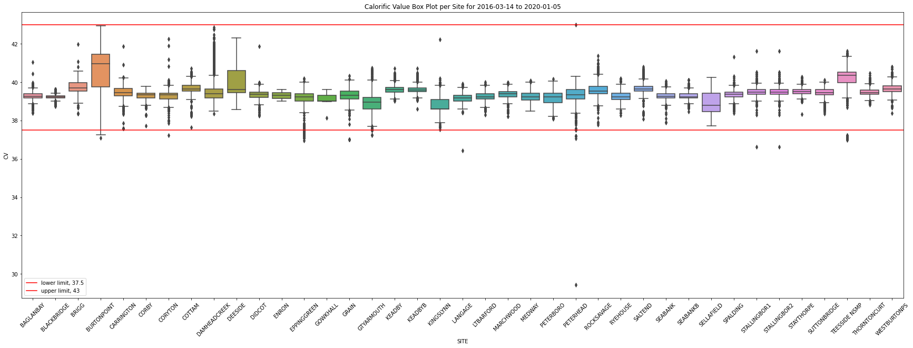
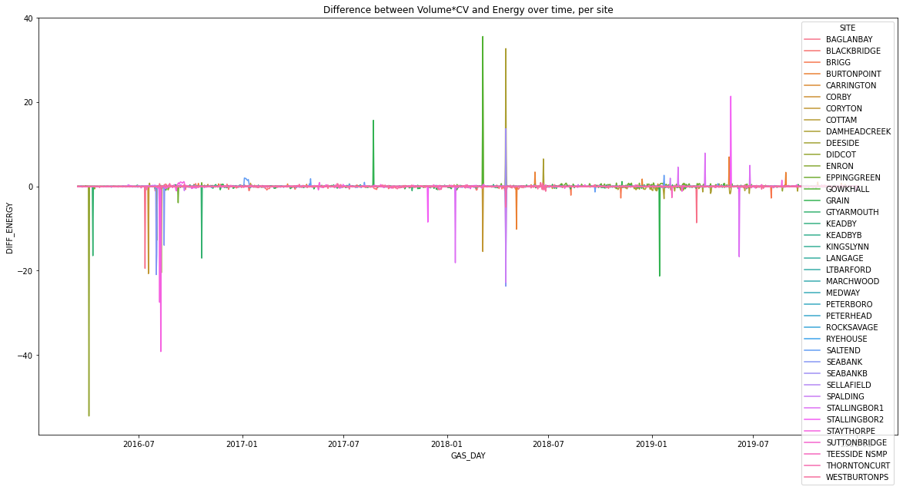

```python
# OPTIONAL: Load the "autoreload" extension so that code can change
%load_ext autoreload

# OPTIONAL: always reload modules so that as you change code in src, it gets loaded
%autoreload 2

%load_ext lab_black

import sys
import os

import pandas as pd
import numpy as np
import matplotlib.pyplot as plt
import seaborn as sns

import statsmodels as sm
import ppscore as pps
import scipy

sys.path.append("..")
from src.data import make_dataset
from src.helpinghand import plot_series

output_dirpath = r"..\\data\\raw"
```

# How efficient are gas fired power stations?

To understand efficiency of gas fired power stations, we must first define what efficiency is. We're defining efficiency in the context of energy conversion, which simplifies the system to mean that efficiency is the total energy in, divided by the total energy out. To calculate this, we convert the total daily UK gas energy (using demand volume and calorific values for powerstations) to GWH/day.

Electricity data is given as average MW values per 30 minute settlement period, we convert this to a total GWH/day.

Efficiency of a power station is then:
Efficiency = (Total Gas Energy [GWH]) / (Total Electricity Energy [GWH])

[https://en.wikipedia.org/wiki/Energy_conversion_efficiency]

We begin by converting our electricity data to GWH.


```python
key = "ELECTRICITY_ACTUALS"
raw_elec_volume_path = os.path.join(output_dirpath, key + ".csv")
if not os.path.isfile(raw_elec_volume_path):
    print("Raw data doesn't exist, so gathering it")
    create_electricity_actuals_dataset(start, end, output_dirpath)

elec = make_dataset.prepare_electricity_actuals(raw_elec_volume_path)
daily_elec_averages = (
    elec[["CCGT", "OCGT"]].fillna(method="ffill").sum(axis=1)
)  # a better way of fillna would be to take the average of the before and after
daily_elec_GWH = daily_elec_averages * 24 / 1000  # convert to a total day GWH
```

Electricity generation from gas shows clear seasonality, this is due to seasonally increased electricity demand, as well as fluctuations in wind and other generation components.


```python
plot_series(daily_elec_GWH.rename("Electricity (GWH)"))
```


    

    


The energy provided by gas is derived from two primary attributes, its' volume and calorifiv value (CV). Volume is measured in MCM (million cubic meters) and refers to the quantity of gas in question. The CV is dependent on the gas content, and refers to the amount of energy released by the gas when a fixed volume is combusted.  [The CV of gas, which is dry, gross and measured at standard conditions of temperature (15oC) and pressure (1013.25 millibars), is usually quoted in megajoules per cubic metre (MJ/m3). Gas passing through our pipeline system has a CV of 37.5 MJ/m3 to 43.0 MJ/m3.]

This means to calculate the energy used we can start by multiplying the volume by the calorific value. Handily for us, this has already been created as a data set along with CV and Volume in the raw dataset source.


```python
key = "GAS_ENERGY"
raw_gas_energy_path = os.path.join(output_dirpath, key + ".csv")
if not os.path.isfile(raw_gas_energy_path):
    print("Raw data doesn't exist, so gathering it")
    create_gas_dataset(key, start, end, output_dirpath)


gas_energy = make_dataset.prepare_gas_data(raw_gas_energy_path).rename(
    {"VALUE": "ENERGY"}, axis=1
)
# kWH

gas_energy = make_dataset.map_to_sites(gas_energy)

# clean up the data types
gas_energy["ENERGY"] = (
    gas_energy["ENERGY"].str.replace(",", "").astype(float)
)  # some rogue string characters in there
gas_energy["ENERGY_GWH"] = gas_energy["ENERGY"] / 1000000

# calculate the daily average energy for all Powerstations
daily_gas_energy = gas_energy.groupby("GAS_DAY")["ENERGY_GWH"].sum().tz_localize(None)
```

    C:\Users\rachel.hassall\.conda\envs\charterful\lib\site-packages\IPython\core\interactiveshell.py:3437: DtypeWarning: Columns (3) have mixed types.Specify dtype option on import or set low_memory=False.
      exec(code_obj, self.user_global_ns, self.user_ns)
    


```python
plot_series(daily_gas_energy.rename("Gas (GWH)"))
```


    

    


Now we have both daily UK Gas and Electricity usage of powerstations in GWH, we can calculate the Efficiency. Looking at the plot of Efficiency over time, there's some pretty high values (over 80%!) in there which don't align with offline research of expected efficiency values of around 50% to 60%. Let's investigate that further!


```python
df = pd.DataFrame({"ELECTRICITY": daily_elec_GWH, "GAS": daily_gas_energy}).dropna()
df["EFFICIENCY"] = df["ELECTRICITY"] / df["GAS"]
df["EFFICIENCY"].describe()
```


    count    1393.000000
    mean        0.687192
    std         0.052073
    min         0.527030
    25%         0.657998
    50%         0.688107
    75%         0.715965
    max         0.895248
    Name: EFFICIENCY, dtype: float64


```python
plot_series(df["EFFICIENCY"].rename("Efficiency"))
```


    

    


## Does Energy = Volume * CV?

One source of error in these high efficiency values could be the data, let's cross check the raw Energy data with recalculating it from both Volume and CV.

- Calorific value is in MJ/scm
- Energy is in kWh
- Volume is in mscm

### Volume


```python
key = "GAS_VOLUME"
raw_gas_volume_path = os.path.join(output_dirpath, key + ".csv")
if not os.path.isfile(raw_gas_volume_path):
    print("Raw data doesn't exist, so gathering it")
    create_gas_dataset(key, start, end, output_dirpath)

gas_volume = make_dataset.prepare_gas_data(raw_gas_volume_path).rename(
    {"VALUE": "VOLUME"}, axis=1
)
# kWH

gas_volume = make_dataset.map_to_sites(gas_volume)
gas_volume.head()
```


<div>
<style scoped>
    .dataframe tbody tr th:only-of-type {
        vertical-align: middle;
    }

    .dataframe tbody tr th {
        vertical-align: top;
    }

    .dataframe thead th {
        text-align: right;
    }
</style>
<table border="1" class="dataframe">
  <thead>
    <tr style="text-align: right;">
      <th></th>
      <th>ITEM</th>
      <th>GAS_DAY</th>
      <th>VOLUME</th>
      <th>SITE</th>
    </tr>
  </thead>
  <tbody>
    <tr>
      <th>17</th>
      <td>NTS PHYSICAL FLOWS, BAGLANBAY, NTS POWER STATION</td>
      <td>2016-03-14</td>
      <td>1.72800</td>
      <td>BAGLANBAY</td>
    </tr>
    <tr>
      <th>23</th>
      <td>NTS PHYSICAL FLOWS, BLACKBRIDGE, NTS POWER STA...</td>
      <td>2016-03-14</td>
      <td>8.12001</td>
      <td>BLACKBRIDGE</td>
    </tr>
    <tr>
      <th>33</th>
      <td>NTS PHYSICAL FLOWS, BRIGG, NTS POWER STATION</td>
      <td>2016-03-14</td>
      <td>0.00000</td>
      <td>BRIGG</td>
    </tr>
    <tr>
      <th>38</th>
      <td>NTS PHYSICAL FLOWS, BURTONPOINT, NTS POWER STA...</td>
      <td>2016-03-14</td>
      <td>0.40800</td>
      <td>BURTONPOINT</td>
    </tr>
    <tr>
      <th>48</th>
      <td>NTS PHYSICAL FLOWS, CORBY, NTS POWER STATION</td>
      <td>2016-03-14</td>
      <td>0.00000</td>
      <td>CORBY</td>
    </tr>
  </tbody>
</table>
</div>


Now we have the gas volumes per powerstation, we can do some quick sense checks and get a feel for the distributions. Everything looks sensible (e.g. no negative volumes)!


```python
fig, ax = plt.subplots(1, 1, figsize=(30, 10))

sns.boxplot(x="SITE", y="VOLUME", data=gas_volume, ax=ax)
ax.set_xticklabels(ax.get_xticklabels(), rotation=45)
plt.title(
    f"Volume Values Box Plot per Site for {gas_volume.GAS_DAY.dt.date.min()} to {gas_volume.GAS_DAY.dt.date.max()}"
)

plt.legend()
plt.show()
```

    No handles with labels found to put in legend.
    


    

    


### CV


```python
key = "GAS_CV"
raw_gas_cv_path = os.path.join(output_dirpath, key + ".csv")
if not os.path.isfile(raw_gas_cv_path):
    print("Raw data doesn't exist, so gathering it")
    create_gas_dataset(key, start, end, output_dirpath)

gas_cv = make_dataset.prepare_gas_data(raw_gas_cv_path).rename({"VALUE": "CV"}, axis=1)
# kWH

gas_cv = make_dataset.map_to_sites(gas_cv)
# MJ/scm
gas_cv.head()
```


<div>
<style scoped>
    .dataframe tbody tr th:only-of-type {
        vertical-align: middle;
    }

    .dataframe tbody tr th {
        vertical-align: top;
    }

    .dataframe thead th {
        text-align: right;
    }
</style>
<table border="1" class="dataframe">
  <thead>
    <tr style="text-align: right;">
      <th></th>
      <th>ITEM</th>
      <th>GAS_DAY</th>
      <th>CV</th>
      <th>SITE</th>
    </tr>
  </thead>
  <tbody>
    <tr>
      <th>17</th>
      <td>CALORIFIC VALUE, BAGLANBAY, NTS POWER STATION</td>
      <td>2016-03-14</td>
      <td>39.21</td>
      <td>BAGLANBAY</td>
    </tr>
    <tr>
      <th>23</th>
      <td>CALORIFIC VALUE, BLACKBRIDGE, NTS POWER STATION</td>
      <td>2016-03-14</td>
      <td>39.15</td>
      <td>BLACKBRIDGE</td>
    </tr>
    <tr>
      <th>33</th>
      <td>CALORIFIC VALUE, BRIGG, NTS POWER STATION</td>
      <td>2016-03-14</td>
      <td>39.74</td>
      <td>BRIGG</td>
    </tr>
    <tr>
      <th>38</th>
      <td>CALORIFIC VALUE, BURTONPOINT, NTS POWER STATION</td>
      <td>2016-03-14</td>
      <td>39.78</td>
      <td>BURTONPOINT</td>
    </tr>
    <tr>
      <th>49</th>
      <td>CALORIFIC VALUE, CORBY, NTS POWER STATION</td>
      <td>2016-03-14</td>
      <td>39.19</td>
      <td>CORBY</td>
    </tr>
  </tbody>
</table>
</div>


The calorific data looks correct, as it varies within the CV system range of 37.5 MJ/m3 to 43.0 MJ/m3 stated in the literature - this gives us confidence in this CV data! Some sites (Burtonpoint, Grain GtYarmouth, Peterhead, Stallingborough) have dropped below the system range minimum, but this seems uncommon. We also lose CV data for Deeside (it's 0!).


```python
gas_cv[gas_cv["CV"] == 0]["SITE"].unique()
```


    ['DEESIDE']
    Categories (1, object): ['DEESIDE']


```python
gas_cv[gas_cv["CV"] != 0]["CV"].describe()
```


    count    52114.000000
    mean        39.418449
    std          0.526722
    min         29.420000
    25%         39.180000
    50%         39.390000
    75%         39.600000
    max         42.980000
    Name: CV, dtype: float64


```python
fig, ax = plt.subplots(1, 1, figsize=(30, 10))

sns.boxplot(x="SITE", y="CV", data=gas_cv[gas_cv["CV"] > 0], ax=ax)
ax.set_xticklabels(ax.get_xticklabels(), rotation=45)
plt.title(
    f"Calorific Value Box Plot per Site for {gas_cv.GAS_DAY.dt.date.min()} to {gas_cv.GAS_DAY.dt.date.max()}"
)
plt.axhline(37.5, label="lower limit, 37.5", c="r")
plt.axhline(43, label="upper limit, 43", c="r")
plt.legend()
plt.show()
```


    

    


## Compare Energy and Volume*CV

[TO DO - explain this calculation a bit more]

- Energy is in kWh
- Calorific value is in MJ/scm
- Volume is in mscm

Calorific Value * Volume = X 10^6 MJ = X * 10^6 * 10^6 J = X * 10^6 * 10^6 / 1000 kJ


Energy = Y kWh = Y *1000 J/s * h = Y * 1000 J/s * 60 * 60 s = Y * 60 *60 J

1 kWh = 3.6 MJ


```python
# get all the data in one dataframe to compare
compare = gas_volume.merge(
    gas_cv, left_on=["GAS_DAY", "SITE"], right_on=["GAS_DAY", "SITE"]
)
compare = compare.merge(
    gas_energy, left_on=["GAS_DAY", "SITE"], right_on=["GAS_DAY", "SITE"]
)

# create our energy col
compare["VOLUME_MULT_CV"] = compare["VOLUME"] * compare["CV"]
compare["VOLUME_MULT_CV_GWH"] = compare["VOLUME_MULT_CV"] / 3.6

# compare
compare = compare[
    ["GAS_DAY", "SITE", "VOLUME", "CV", "VOLUME_MULT_CV_GWH", "ENERGY_GWH",]
]

compare["DIFF_ENERGY"] = compare["ENERGY_GWH"] - compare["VOLUME_MULT_CV_GWH"]
compare
```


<div>
<style scoped>
    .dataframe tbody tr th:only-of-type {
        vertical-align: middle;
    }

    .dataframe tbody tr th {
        vertical-align: top;
    }

    .dataframe thead th {
        text-align: right;
    }
</style>
<table border="1" class="dataframe">
  <thead>
    <tr style="text-align: right;">
      <th></th>
      <th>GAS_DAY</th>
      <th>SITE</th>
      <th>VOLUME</th>
      <th>CV</th>
      <th>VOLUME_MULT_CV_GWH</th>
      <th>ENERGY_GWH</th>
      <th>DIFF_ENERGY</th>
    </tr>
  </thead>
  <tbody>
    <tr>
      <th>0</th>
      <td>2016-03-14</td>
      <td>BAGLANBAY</td>
      <td>1.72800</td>
      <td>39.21</td>
      <td>18.820800</td>
      <td>18.816562</td>
      <td>-0.004238</td>
    </tr>
    <tr>
      <th>1</th>
      <td>2016-03-14</td>
      <td>BLACKBRIDGE</td>
      <td>8.12001</td>
      <td>39.15</td>
      <td>88.305109</td>
      <td>88.322211</td>
      <td>0.017102</td>
    </tr>
    <tr>
      <th>2</th>
      <td>2016-03-14</td>
      <td>BRIGG</td>
      <td>0.00000</td>
      <td>39.74</td>
      <td>0.000000</td>
      <td>0.000000</td>
      <td>0.000000</td>
    </tr>
    <tr>
      <th>3</th>
      <td>2016-03-14</td>
      <td>BURTONPOINT</td>
      <td>0.40800</td>
      <td>39.78</td>
      <td>4.508400</td>
      <td>4.504462</td>
      <td>-0.003938</td>
    </tr>
    <tr>
      <th>4</th>
      <td>2016-03-14</td>
      <td>CORBY</td>
      <td>0.00000</td>
      <td>39.19</td>
      <td>0.000000</td>
      <td>0.000000</td>
      <td>0.000000</td>
    </tr>
    <tr>
      <th>...</th>
      <td>...</td>
      <td>...</td>
      <td>...</td>
      <td>...</td>
      <td>...</td>
      <td>...</td>
      <td>...</td>
    </tr>
    <tr>
      <th>52333</th>
      <td>2020-01-05</td>
      <td>STAYTHORPE</td>
      <td>1.32000</td>
      <td>39.45</td>
      <td>14.465000</td>
      <td>14.455556</td>
      <td>-0.009444</td>
    </tr>
    <tr>
      <th>52334</th>
      <td>2020-01-05</td>
      <td>SUTTONBRIDGE</td>
      <td>0.21300</td>
      <td>39.33</td>
      <td>2.327025</td>
      <td>2.327778</td>
      <td>0.000753</td>
    </tr>
    <tr>
      <th>52335</th>
      <td>2020-01-05</td>
      <td>TEESSIDE NSMP</td>
      <td>0.01398</td>
      <td>39.57</td>
      <td>0.153664</td>
      <td>0.153610</td>
      <td>-0.000054</td>
    </tr>
    <tr>
      <th>52336</th>
      <td>2020-01-05</td>
      <td>THORNTONCURT</td>
      <td>0.57290</td>
      <td>39.32</td>
      <td>6.257341</td>
      <td>6.258889</td>
      <td>0.001548</td>
    </tr>
    <tr>
      <th>52337</th>
      <td>2020-01-05</td>
      <td>WESTBURTONPS</td>
      <td>4.18100</td>
      <td>39.93</td>
      <td>46.374258</td>
      <td>46.377778</td>
      <td>0.003520</td>
    </tr>
  </tbody>
</table>
<p>52338 rows × 7 columns</p>
</div>


There is consistently a small difference in energy vs volume*CV between sites (they should be the same). Looking at the total difference per day this is centred near 0 but can increase quite high both positively and negatively.


```python
compare["DIFF_ENERGY"].describe()
```


    count    38411.000000
    mean        -0.009799
    std          0.656229
    min        -54.510192
    25%         -0.002326
    50%          0.000000
    75%          0.000699
    max         35.591667
    Name: DIFF_ENERGY, dtype: float64


```python
plot_series(compare.groupby("GAS_DAY")["DIFF_ENERGY"].sum())
```


    

    


It looks like there are some blips in differences between Energy and Volume*CV, across multiple sites, interesting! I wonder which is correct... It doesn't seem to be limited to a single site.


```python
fig, ax = plt.subplots(1, 1, figsize=(20, 10))

sns.lineplot(
    data=compare, x="GAS_DAY", y="DIFF_ENERGY", hue="SITE", ax=ax,
)
plt.title("Difference between Volume*CV and Energy over time, per site")
plt.show()
```


    

    


The raw energy data seems to be lower than that calculated using Volume and CV.


```python
fig, ax = plt.subplots(1, 2, figsize=(20, 10))
ax[0].set_title(f"Energy Histogram")
ax[1].set_title(f"Energy Over Time")

# the energy from the data
timeseries = daily_gas_energy.rename("Gas (GWH) from Energy")
sns.histplot(timeseries, kde=True, ax=ax[0], label=timeseries.name, alpha=0.3)
ax[1].plot(timeseries, label=timeseries.name)

# calculate the daily average energy for all Powerstations
daily_gas_volume_mult_cv = (
    compare.groupby("GAS_DAY")["VOLUME_MULT_CV_GWH"].sum().tz_localize(None)
)
timeseries = daily_gas_volume_mult_cv.rename("Gas (GWH) from Volume Multiplied by CV")
sns.histplot(
    timeseries, kde=True, ax=ax[0], label=timeseries.name, alpha=0.3, color="orange"
)
ax[1].plot(timeseries, label=timeseries.name, color="orange")
ax[1].legend()
plt.show()
```


    

    


Worth investigating down the line where these differences come from. For our final comparison, let's calculate efficiency with the energy values dereived from volume and CV, to see if these give more realistic efficiency values.

This does indeed seem to reduce our efficiencies down to reasonable levels, fantastic! We shall use our the calculated Energy (from Volume and CV) for the remainder of this analysis.


```python
df = pd.DataFrame(
    {"ELECTRICITY": daily_elec_GWH, "GAS": daily_gas_volume_mult_cv}
).dropna()
df["EFFICIENCY"] = df["ELECTRICITY"] / df["GAS"]
df["EFFICIENCY"].describe()
```


    count    1393.000000
    mean        0.543969
    std         0.020303
    min         0.440361
    25%         0.532200
    50%         0.544305
    75%         0.555938
    max         0.668640
    Name: EFFICIENCY, dtype: float64


```python
plot_series(df["EFFICIENCY"].rename("Efficiency"))
```


    

    


# How efficient are individual gas fired power stations?

We have total electricity actual data, and individual gas power station data. If we had individual electricity actual data it would be simple to calculate each individual powerstation's efficiency but as it stands we don't. However, maybe there is a way around this. Can we solve it without?

We know...

Electricity Energy = Efficiency * Gas Energy

Electricity Energy (UK) = Efficiency (Powerstation A) * Gas Energy (Powerstation A) + Efficiency (Powerstation B) * Gas Energy (Powerstation B) + ....

$ UK Electricity Energy = \sum \limits _{i=1}  (Efficiency)_{i}*{(Gas Energy)}_{i} $

We have this equation for various time periods, creating a series of simultaneous equations and an overdetermined system (more equations than required to solve, meaning some variations in the solution and not one clear solution.

[https://dwightreid.com/blog/2015/09/21/python-how-to-solve-simultaneous-equations/]
[https://en.wikipedia.org/wiki/Overdetermined_system]


```python
# we set up our equations as a dataframe of multiple days, where each day is an equation
gas_powerstations = (
    compare.groupby(["GAS_DAY", "SITE"])["VOLUME_MULT_CV_GWH"].sum().unstack()
)
equations_df = df.merge(gas_powerstations, left_index=True, right_index=True).drop(
    ["GAS", "EFFICIENCY"], axis=1
)
equations_df.head()
```


<div>
<style scoped>
    .dataframe tbody tr th:only-of-type {
        vertical-align: middle;
    }

    .dataframe tbody tr th {
        vertical-align: top;
    }

    .dataframe thead th {
        text-align: right;
    }
</style>
<table border="1" class="dataframe">
  <thead>
    <tr style="text-align: right;">
      <th></th>
      <th>ELECTRICITY</th>
      <th>BAGLANBAY</th>
      <th>BLACKBRIDGE</th>
      <th>BRIGG</th>
      <th>BURTONPOINT</th>
      <th>CARRINGTON</th>
      <th>CORBY</th>
      <th>CORYTON</th>
      <th>COTTAM</th>
      <th>DAMHEADCREEK</th>
      <th>...</th>
      <th>SEABANKB</th>
      <th>SELLAFIELD</th>
      <th>SPALDING</th>
      <th>STALLINGBOR1</th>
      <th>STALLINGBOR2</th>
      <th>STAYTHORPE</th>
      <th>SUTTONBRIDGE</th>
      <th>TEESSIDE NSMP</th>
      <th>THORNTONCURT</th>
      <th>WESTBURTONPS</th>
    </tr>
    <tr>
      <th>GAS_DAY</th>
      <th></th>
      <th></th>
      <th></th>
      <th></th>
      <th></th>
      <th></th>
      <th></th>
      <th></th>
      <th></th>
      <th></th>
      <th></th>
      <th></th>
      <th></th>
      <th></th>
      <th></th>
      <th></th>
      <th></th>
      <th></th>
      <th></th>
      <th></th>
      <th></th>
    </tr>
  </thead>
  <tbody>
    <tr>
      <th>2016-03-14</th>
      <td>362.7460</td>
      <td>18.820800</td>
      <td>88.305109</td>
      <td>0.0</td>
      <td>4.508400</td>
      <td>0.0</td>
      <td>0.0</td>
      <td>0.000000</td>
      <td>16.381783</td>
      <td>28.162952</td>
      <td>...</td>
      <td>0.000000</td>
      <td>6.856192</td>
      <td>26.119624</td>
      <td>13.126986</td>
      <td>0.0</td>
      <td>47.877914</td>
      <td>27.128444</td>
      <td>0.0</td>
      <td>6.557813</td>
      <td>29.619889</td>
    </tr>
    <tr>
      <th>2016-03-15</th>
      <td>392.7550</td>
      <td>20.070400</td>
      <td>90.905480</td>
      <td>0.0</td>
      <td>6.851140</td>
      <td>0.0</td>
      <td>0.0</td>
      <td>0.000000</td>
      <td>14.150221</td>
      <td>28.378930</td>
      <td>...</td>
      <td>0.000000</td>
      <td>6.869108</td>
      <td>33.012509</td>
      <td>12.152930</td>
      <td>0.0</td>
      <td>55.341519</td>
      <td>24.287694</td>
      <td>0.0</td>
      <td>7.073477</td>
      <td>28.581880</td>
    </tr>
    <tr>
      <th>2016-03-16</th>
      <td>393.2615</td>
      <td>19.087139</td>
      <td>93.481002</td>
      <td>0.0</td>
      <td>4.285084</td>
      <td>0.0</td>
      <td>0.0</td>
      <td>0.000000</td>
      <td>19.215700</td>
      <td>28.235037</td>
      <td>...</td>
      <td>0.435133</td>
      <td>6.950579</td>
      <td>32.856884</td>
      <td>13.188274</td>
      <td>0.0</td>
      <td>51.202090</td>
      <td>19.532903</td>
      <td>0.0</td>
      <td>9.834221</td>
      <td>32.598720</td>
    </tr>
    <tr>
      <th>2016-03-17</th>
      <td>406.4755</td>
      <td>20.169560</td>
      <td>86.904440</td>
      <td>0.0</td>
      <td>14.747552</td>
      <td>0.0</td>
      <td>0.0</td>
      <td>0.000000</td>
      <td>17.615189</td>
      <td>28.167780</td>
      <td>...</td>
      <td>11.073113</td>
      <td>7.053307</td>
      <td>32.005159</td>
      <td>20.173457</td>
      <td>0.0</td>
      <td>38.570522</td>
      <td>22.715600</td>
      <td>0.0</td>
      <td>6.964273</td>
      <td>35.880283</td>
    </tr>
    <tr>
      <th>2016-03-18</th>
      <td>407.2865</td>
      <td>20.052197</td>
      <td>96.429172</td>
      <td>0.0</td>
      <td>23.412927</td>
      <td>0.0</td>
      <td>0.0</td>
      <td>0.006512</td>
      <td>17.303125</td>
      <td>29.227487</td>
      <td>...</td>
      <td>0.000000</td>
      <td>5.428625</td>
      <td>32.314143</td>
      <td>20.224020</td>
      <td>0.0</td>
      <td>32.182415</td>
      <td>28.391000</td>
      <td>0.0</td>
      <td>8.232894</td>
      <td>38.146450</td>
    </tr>
  </tbody>
</table>
<p>5 rows × 40 columns</p>
</div>


We know the bounds of the solution, i.e. non-negative between 0 and 1, so we use a bounded linear least squares solver.


```python
from scipy.optimize import lsq_linear

equation_efficiencies = lsq_linear(
    equations_df[gas_powerstations.columns].values,
    equations_df["ELECTRICITY"].values,
    bounds=(0, 1),  # efficiencies should be between 0 and 1
    verbose=2,
)

equation_efficiencies
```

       Iteration        Cost      Cost reduction    Step norm     Optimality   
           0         6.5071e+04                                    1.72e+05    
           1         5.6769e+04      8.30e+03       1.55e-01       3.48e+04    
           2         5.6356e+04      4.14e+02       1.14e-01       2.66e+03    
           3         5.5873e+04      4.83e+02       6.63e-01       1.99e+02    
           4         5.5707e+04      1.66e+02       3.12e-01       3.43e+01    
           5         5.5672e+04      3.52e+01       2.08e-02       2.51e+00    
           6         5.5669e+04      2.74e+00       1.74e-03       1.65e-02    
           7         5.5669e+04      1.72e-02       1.14e-05       8.36e-05    
           8         5.5669e+04      8.80e-05       5.83e-08       7.02e-09    
           9         5.5669e+04      7.39e-09       4.90e-12       5.04e-10    
    The relative change of the cost function is less than `tol`.
    Number of iterations 10, initial cost 6.5071e+04, final cost 5.5669e+04, first-order optimality 5.04e-10.
    


     active_mask: array([ 0,  0,  0,  0,  0,  0,  0,  0,  0,  1,  0,  0,  0,  1,  0,  0,  0,
           -1,  0,  0,  0,  0,  0,  0,  0,  0,  0,  0,  0,  0,  0,  0,  0,  0,
            0,  0, -1, -1,  0])
            cost: 55668.90779997654
             fun: array([ 3.62161224, -1.49710368,  1.95411906, ..., -2.26570606,
           -8.92042888, -5.76767539])
         message: 'The relative change of the cost function is less than `tol`.'
             nit: 10
      optimality: 5.035505374005272e-10
          status: 2
         success: True
               x: array([6.93509122e-01, 4.75652638e-01, 6.14499210e-01, 5.13792691e-01,
           4.52441221e-01, 4.18269076e-01, 5.06656686e-01, 3.92867365e-01,
           6.72720692e-01, 1.00000000e+00, 5.14027386e-01, 1.00000000e-01,
           4.14238651e-01, 1.00000000e+00, 6.16100153e-01, 5.46415901e-01,
           5.79025482e-01, 9.77908414e-25, 3.71588868e-01, 6.54399825e-01,
           5.51601279e-01, 6.75653495e-01, 4.79402702e-01, 6.21155539e-01,
           5.05954790e-01, 5.90504824e-01, 4.90471159e-01, 6.29699710e-01,
           5.49998438e-01, 5.01982382e-01, 8.45698142e-01, 5.26266910e-01,
           4.17557943e-01, 4.38448726e-01, 6.00937024e-01, 4.46313622e-01,
           2.06902949e-22, 2.79534549e-20, 5.64631674e-01])


The results show some super high and low alues, albeit more realistic. Let's further reduce the bounds to a more realistic solution.


```python
dict(zip(gas_powerstations.columns, equation_efficiencies.x))
```


    {'BAGLANBAY': 0.6935091217720427,
     'BLACKBRIDGE': 0.4756526383545819,
     'BRIGG': 0.6144992100047235,
     'BURTONPOINT': 0.5137926909624148,
     'CARRINGTON': 0.45244122071237153,
     'CORBY': 0.4182690756757522,
     'CORYTON': 0.5066566862123504,
     'COTTAM': 0.3928673654791052,
     'DAMHEADCREEK': 0.6727206917365993,
     'DEESIDE': 0.9999999999999999,
     'DIDCOT': 0.5140273860151393,
     'ENRON': 0.1,
     'EPPINGGREEN': 0.41423865103968227,
     'GOWKHALL': 0.9999999999999999,
     'GRAIN': 0.6161001528022344,
     'GTYARMOUTH': 0.5464159005885253,
     'KEADBY': 0.5790254818116337,
     'KEADBYB': 9.779084136250261e-25,
     'KINGSLYNN': 0.3715888680827427,
     'LANGAGE': 0.6543998248684232,
     'LTBARFORD': 0.551601279014818,
     'MARCHWOOD': 0.675653494905483,
     'MEDWAY': 0.47940270216704534,
     'PETERBORO': 0.6211555390590143,
     'PETERHEAD': 0.505954790079637,
     'ROCKSAVAGE': 0.5905048240206678,
     'RYEHOUSE': 0.4904711589332516,
     'SALTEND': 0.6296997095798204,
     'SEABANK': 0.5499984383691051,
     'SEABANKB': 0.5019823819108771,
     'SELLAFIELD': 0.845698142202071,
     'SPALDING': 0.526266909849594,
     'STALLINGBOR1': 0.4175579432611722,
     'STALLINGBOR2': 0.43844872632096127,
     'STAYTHORPE': 0.6009370244420119,
     'SUTTONBRIDGE': 0.4463136219722155,
     'TEESSIDE NSMP': 2.0690294940323356e-22,
     'THORNTONCURT': 2.795345485390075e-20,
     'WESTBURTONPS': 0.5646316739898536}


```python
equation_efficiencies = lsq_linear(
    equations_df[gas_powerstations.columns].values,
    equations_df["ELECTRICITY"].values,
    bounds=(0.2, 0.9),
    verbose=2,
)

equation_efficiencies
```

       Iteration        Cost      Cost reduction    Step norm     Optimality   
           0         8.2273e+04                                    1.64e+05    
           1         5.8882e+04      2.34e+04       2.43e-01       6.32e+03    
           2         5.7166e+04      1.72e+03       4.10e-01       9.16e+02    
           3         5.6533e+04      6.33e+02       2.47e-01       1.74e+02    
           4         5.6378e+04      1.55e+02       1.54e-01       1.43e+01    
           5         5.6364e+04      1.42e+01       1.35e-02       1.36e-01    
           6         5.6363e+04      1.37e-01       1.69e-04       1.28e-05    
           7         5.6363e+04      1.29e-05       2.18e-08       1.65e-10    
           8         5.6363e+04      1.65e-10       2.81e-13       1.42e-10    
    The relative change of the cost function is less than `tol`.
    Number of iterations 9, initial cost 8.2273e+04, final cost 5.6363e+04, first-order optimality 1.42e-10.
    


     active_mask: array([ 0,  0,  0,  0,  0,  0,  0,  0,  0,  1,  0,  0,  0,  1,  0,  0,  0,
           -1,  0,  0,  0,  0,  0,  0,  0,  0,  0,  0,  0,  0,  0,  0,  0,  0,
            0,  0, -1, -1,  0])
            cost: 56363.392125637176
             fun: array([ 3.48563664, -1.59411266,  1.93104297, ..., -2.01392482,
           -8.55850168, -5.68756923])
         message: 'The relative change of the cost function is less than `tol`.'
             nit: 9
      optimality: 1.4162490195327647e-10
          status: 2
         success: True
               x: array([0.71269267, 0.46983915, 0.49900649, 0.51625479, 0.44901336,
           0.39759186, 0.50321656, 0.38153324, 0.67308559, 0.9       ,
           0.51446624, 0.4       , 0.41883048, 0.9       , 0.61033576,
           0.55043822, 0.58734499, 0.2       , 0.33589294, 0.6564851 ,
           0.55620252, 0.66882488, 0.48324847, 0.55659536, 0.50007634,
           0.59148838, 0.49597248, 0.62758604, 0.55225335, 0.50259474,
           0.76348492, 0.5297843 , 0.41750848, 0.43002886, 0.5982964 ,
           0.45133847, 0.2       , 0.2       , 0.56102697])


Some of these look a little off, e.g. Teesside NSMP, ThorntonCurt.


```python
dict(zip(gas_powerstations.columns, equation_efficiencies.x))
```


    {'BAGLANBAY': 0.7126926748726649,
     'BLACKBRIDGE': 0.4698391533694381,
     'BRIGG': 0.499006489237169,
     'BURTONPOINT': 0.5162547929159554,
     'CARRINGTON': 0.44901335702477213,
     'CORBY': 0.39759185939431746,
     'CORYTON': 0.5032165630626901,
     'COTTAM': 0.38153324235589586,
     'DAMHEADCREEK': 0.6730855875802476,
     'DEESIDE': 0.8999999999999999,
     'DIDCOT': 0.5144662442847171,
     'ENRON': 0.4000000000000628,
     'EPPINGGREEN': 0.41883047544890006,
     'GOWKHALL': 0.8999999999999999,
     'GRAIN': 0.6103357621752917,
     'GTYARMOUTH': 0.5504382164278945,
     'KEADBY': 0.5873449859470644,
     'KEADBYB': 0.20000000000000004,
     'KINGSLYNN': 0.33589293554682836,
     'LANGAGE': 0.656485098916203,
     'LTBARFORD': 0.5562025245693738,
     'MARCHWOOD': 0.6688248758163583,
     'MEDWAY': 0.48324846851084613,
     'PETERBORO': 0.5565953626621781,
     'PETERHEAD': 0.5000763385971926,
     'ROCKSAVAGE': 0.591488379105471,
     'RYEHOUSE': 0.49597248429602203,
     'SALTEND': 0.6275860440551995,
     'SEABANK': 0.552253347429545,
     'SEABANKB': 0.5025947421231127,
     'SELLAFIELD': 0.7634849159553514,
     'SPALDING': 0.5297843012921287,
     'STALLINGBOR1': 0.4175084777093931,
     'STALLINGBOR2': 0.43002885754203435,
     'STAYTHORPE': 0.5982964020220808,
     'SUTTONBRIDGE': 0.4513384682620729,
     'TEESSIDE NSMP': 0.20000000000000004,
     'THORNTONCURT': 0.20000000000000004,
     'WESTBURTONPS': 0.5610269745243627}


We could sense check these values with a random spot check using maximum capacity data from https://electricityproduction.uk/plant/. A quick look at some of the 0.2 values, indicates these sites also have wind farms, interesting!
