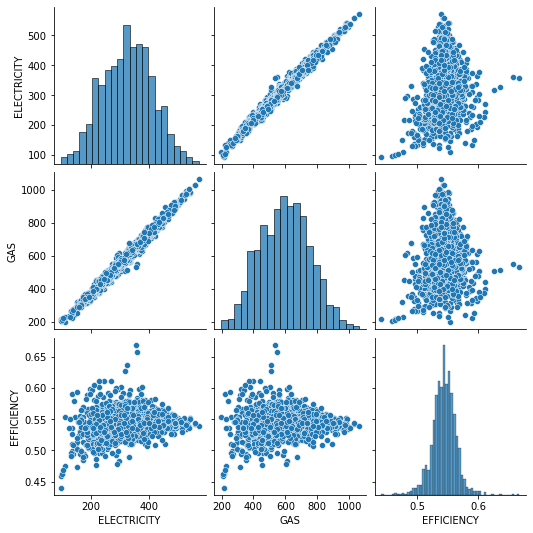

```python
# OPTIONAL: Load the "autoreload" extension so that code can change
%load_ext autoreload

# OPTIONAL: always reload modules so that as you change code in src, it gets loaded
%autoreload 2

%load_ext lab_black

import sys
import os

import pandas as pd
import numpy as np
import matplotlib.pyplot as plt
import seaborn as sns

import statsmodels as sm
import ppscore as pps
import scipy

sys.path.append("..")
from src.data import make_dataset

output_dirpath = r"..\\data\\raw"
```

    The autoreload extension is already loaded. To reload it, use:
      %reload_ext autoreload
    The lab_black extension is already loaded. To reload it, use:
      %reload_ext lab_black
    


```python
key = "ELECTRICITY_ACTUALS"
raw_elec_volume_path = os.path.join(output_dirpath, key + ".csv")
if not os.path.isfile(raw_elec_volume_path):
    print("Raw data doesn't exist, so gathering it")
    create_electricity_actuals_dataset(start, end, output_dirpath)

elec = make_dataset.prepare_electricity_actuals(raw_elec_volume_path)
daily_elec_averages = (
    elec[["CCGT", "OCGT"]].fillna(method="ffill").sum(axis=1)
)  # a better way of fillna would be to take the average of the before and after
daily_elec_GWH = daily_elec_averages * 24 / 1000  # convert to a total day GWH
```


```python
key = "GAS_VOLUME"
raw_gas_volume_path = os.path.join(output_dirpath, key + ".csv")
if not os.path.isfile(raw_gas_volume_path):
    print("Raw data doesn't exist, so gathering it")
    create_gas_dataset(key, start, end, output_dirpath)

gas_volume = make_dataset.prepare_gas_data(raw_gas_volume_path).rename(
    {"VALUE": "VOLUME"}, axis=1
)
# kWH

gas_volume = make_dataset.map_to_sites(gas_volume)


key = "GAS_CV"
raw_gas_cv_path = os.path.join(output_dirpath, key + ".csv")
if not os.path.isfile(raw_gas_cv_path):
    print("Raw data doesn't exist, so gathering it")
    create_gas_dataset(key, start, end, output_dirpath)

gas_cv = make_dataset.prepare_gas_data(raw_gas_cv_path).rename({"VALUE": "CV"}, axis=1)
# kWH

gas_cv = make_dataset.map_to_sites(gas_cv)

gas_energy = gas_volume.merge(
    gas_cv, left_on=["GAS_DAY", "SITE"], right_on=["GAS_DAY", "SITE"]
)

gas_energy["VOLUME_MULT_CV"] = gas_energy["VOLUME"] * gas_energy["CV"]
gas_energy["ENERGY_GWH"] = gas_energy["VOLUME_MULT_CV"] / 3.6

# calculate the daily average energy for all Powerstations
daily_gas_energy = gas_energy.groupby("GAS_DAY")["ENERGY_GWH"].sum().tz_localize(None)
```


```python
df = pd.DataFrame({"ELECTRICITY": daily_elec_GWH, "GAS": daily_gas_energy}).dropna()
df["EFFICIENCY"] = df["ELECTRICITY"] / df["GAS"]
df.head()
```


<div>
<style scoped>
    .dataframe tbody tr th:only-of-type {
        vertical-align: middle;
    }

    .dataframe tbody tr th {
        vertical-align: top;
    }

    .dataframe thead th {
        text-align: right;
    }
</style>
<table border="1" class="dataframe">
  <thead>
    <tr style="text-align: right;">
      <th></th>
      <th>ELECTRICITY</th>
      <th>GAS</th>
      <th>EFFICIENCY</th>
    </tr>
    <tr>
      <th>GAS_DAY</th>
      <th></th>
      <th></th>
      <th></th>
    </tr>
  </thead>
  <tbody>
    <tr>
      <th>2016-03-14</th>
      <td>362.7460</td>
      <td>665.422143</td>
      <td>0.545137</td>
    </tr>
    <tr>
      <th>2016-03-15</th>
      <td>392.7550</td>
      <td>708.304806</td>
      <td>0.554500</td>
    </tr>
    <tr>
      <th>2016-03-16</th>
      <td>393.2615</td>
      <td>716.165089</td>
      <td>0.549121</td>
    </tr>
    <tr>
      <th>2016-03-17</th>
      <td>406.4755</td>
      <td>739.237716</td>
      <td>0.549858</td>
    </tr>
    <tr>
      <th>2016-03-18</th>
      <td>407.2865</td>
      <td>724.488819</td>
      <td>0.562171</td>
    </tr>
  </tbody>
</table>
</div>


```python
def plot_series(timeseries):
    """
    handy plots for a timeseries, histogram and also values over time
    
    Args:
        timeseries (pd.Series) : data to plot
    """
    fig, ax = plt.subplots(1, 2, figsize=(20, 10))

    sns.histplot(timeseries, kde=True, ax=ax[0])
    ax[0].set_title(f"{timeseries.name} Histogram")

    ax[1].plot(timeseries)
    ax[1].set_title(f"{timeseries.name} Over Time")
    plt.show()
```

# Does Efficiency change seasonally?

In time series analysis, "seasonally" is used generically to mean patterns in data with a certain period. For example we can have yearly seasonality (winter effects) with a period of 365 days, as well as monthly seasonality (month end) with a period of 30 days and weekly seasonality (weekend effects) with a period of 7 days.

We can begin to decompose any seasonal affects by doing autocorrelation analysis and comparing each value with a lagged version of itself i.e. compare today's value with the value from a year ago.


```python
from statsmodels.graphics import tsaplots

fig, ax = plt.subplots(1, 1, figsize=(20, 10))

lags = None

a = tsaplots.plot_acf(df["EFFICIENCY"], lags=lags, ax=ax)
```


    

    


```python
b = tsaplots.plot_pacf(df["EFFICIENCY"], lags=lags)
```


    

    


A more complex method is to build an additive model to understand various seasonal components, the facebook prophet library does this very well so let's have a look.


```python
from statsmodels.tsa.seasonal import seasonal_decompose

seasonality = seasonal_decompose(df["EFFICIENCY"], model="additive")

a = seasonality.plot()
```


    

    


```python
# from prophet import Prophet
#
# proph_data = df["EFFICIENCY"].reset_index()
# proph_data = proph_data.rename({"GAS_DAY" : "ds", "EFFICIENCY" : "y"}, axis=1)
#
# m = Prophet()
# m.fit()
#
# future = m.make_future_dataframe(periods=365)
#
# forecast = m.predict(future)
#
#
# fig2 = m.plot_components(forecast)
```

# How does Temperature interact with CV?


```python
key = "temperature"
raw_temp_path = os.path.join(output_dirpath, key + ".csv")
if not os.path.isfile(raw_temp_path):
    print("Raw data doesn't exist, so gathering it")
    create_gas_dataset(key, start, end, output_dirpath)


temperature = make_dataset.prepare_gas_data(
    raw_temp_path, keep_powerstations_only=False,
)
temperature = temperature.groupby("GAS_DAY")["VALUE"].mean().rename("TEMPERATURE")
```


```python
plot_series(temperature)
```


    

    


# Does Temperature affect Efficiency?


```python
df = df.merge(temperature, how="left", left_on="GAS_DAY", right_on="GAS_DAY")
df = df[df.index.year > 2017]
```


```python
sns.scatterplot(data=df, x="TEMPERATURE", y="EFFICIENCY")
plt.title("Temperature vs Average Powerstation Efficiency")
plt.show()
```


    

    


```python
sns.scatterplot(data=df.pct_change(), x="TEMPERATURE", y="EFFICIENCY")
plt.title("Percent Change in Temperature vs Percent Change in Powerstation Efficiency")
plt.show()
```


    

    


```python
sns.scatterplot(data=df.diff(), x="TEMPERATURE", y="EFFICIENCY")
plt.title("Daily Change in Temperature vs Daily Change in Powerstation Efficiency")
plt.show()
```


    

    


# Archive


```python
fig, ax = plt.subplots(1, 1, figsize=(20, 10))

sns.lineplot(
    data=gas_energy[gas_energy["POWERSTATION"]].dropna(),
    x="GAS_DAY",
    y="ENERGY",
    hue="SITE",
    ax=ax,
)
```


```python
gas_cv = make_dataset.prepare_gas_data(
    r"C:\Users\rachel.hassall\git\charterful\data\raw\GAS_CV.csv"
).rename({"VALUE": "CV"}, axis=1)
gas_cv = gas_cv[gas_cv["CV"] <= 43][37.5 <= gas_cv["CV"]]
cv_item_mapping = {}
for item in gas_cv["ITEM"].unique():
    try:
        site = item.split(",")[1].strip()
        cv_item_mapping[item] = site
    except:
        print(item)
gas_cv["SITE"] = gas_cv["ITEM"].map(cv_item_mapping)
```


```python
volume_item_mapping = {}
for item in volume["ITEM"].unique():
    try:
        site = item.split(",")[1].strip()
        volume_item_mapping[item] = site
    except:
        print(item)

volume["SITE"] = volume["ITEM"].map(volume_item_mapping)
```


```python
gas = pd.merge(volume, gas_cv, on=["SITE", "GAS_DAY"], suffixes=("_VOLUME", "_CV"))
gas["ENERGY_MJ"] = (gas["VOLUME"] / 1000000) * gas["CV"]

# M M3 * MJ/m3.
```


```python
gas
```


```python
daily_gas_volumes = (
    gas[gas["POWERSTATION_VOLUME"]].groupby("GAS_DAY")["VOLUME"].sum().tz_localize(None)
)
```


```python
daily_gas_cv = (
    gas[gas["POWERSTATION_CV"]].groupby("GAS_DAY")["CV"].mean().tz_localize(None)
)
```


```python
daily_gas_MJ = (
    gas[gas["POWERSTATION_CV"]].groupby("GAS_DAY")["ENERGY_MJ"].sum().tz_localize(None)
)
```


```python
daily_gas_GWH = daily_gas_volumes * 10.895
```

Similarly, seasonality is visible in the power station gas demand. There appear to be anomalies in the peak demeand at the start of every year, suggesting a possible accounting error and will be removed from further analysis.


```python
plot_series(daily_gas_MJ.rename("Gas (MJ)"))
```


```python
plot_series(daily_gas_GWH.rename("Gas (GWH)"))
```


```python
daily_gas_GWH = daily_gas_GWH[daily_gas_GWH < 1250]
```

## Does Calorific Value affect Efficiency?

Calorific value (CV) is a measure of heating power and is dependent upon the composition of the gas. The CV refers to the amount of energy released when a known volume of gas is completely combusted under specified conditions. The CV of gas, which is dry, gross and measured at standard conditions of temperature (15oC) and pressure (1013.25 millibars), is usually quoted in megajoules per cubic metre (MJ/m3). Gas passing through our pipeline system has a CV of 37.5 MJ/m3 to 43.0 MJ/m3.

[https://www.nationalgrid.com/uk/gas-transmission/data-and-operations/calorific-value-cv]


```python
gas_cv = make_dataset.prepare_gas_data(
    r"C:\Users\rachel.hassall\git\charterful\data\raw\GAS_CV.csv"
)
gas_cv = gas_cv[gas_cv["VALUE"] != 0]
daily_gas_cv = (
    gas_cv[gas_cv["POWERSTATION"]].groupby("GAS_DAY")["VALUE"].mean().tz_localize(None)
)
df = df.merge(daily_gas_cv.rename("CV"), how="left", left_index=True, right_index=True)
```


```python
fig, ax = plt.subplots(1, 1, figsize=(20, 10))

sns.lineplot(
    data=gas_cv[gas_cv["POWERSTATION"]][["GAS_DAY", "ITEM", "VALUE"]],
    x="GAS_DAY",
    y="VALUE",
    hue="ITEM",
    ax=ax,
    palette="Set2",
)
plt.legend(bbox_to_anchor=(1.01, 1), borderaxespad=0)
```


```python
plot_series(df["CV"].rename("Calorific Value"))
```


```python
plt.scatter(df["CV"], df["EFFICIENCY"])
plt.title("CV vs Powerstation Efficiency")
plt.show()
```
